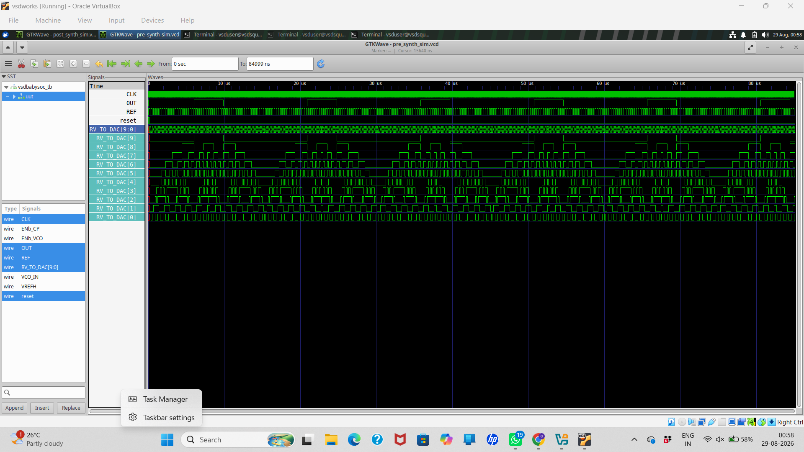

# BabySoC — Complete RTL to Physical Design Flow

## 1. Project Overview

This repository documents the BabySoC digital design flow from RTL design and functional simulation through synthesis, post-synthesis Gate-Level Simulation (GLS), and preparation for Physical Design (PD).

The complete flow is:

```text
Specification
    ↓
RTL Design (Verilog)
    ↓
Testbench
    ↓
Pre-Synthesis / RTL Simulation
    ↓
GTKWave Verification
    ↓
Logic Synthesis using Yosys
    ↓
Technology Mapping to SKY130 Standard Cells
    ↓
Gate-Level Netlist
    ↓
Post-Synthesis Gate-Level Simulation (GLS)
    ↓
GTKWave Verification
    ↓
PRE vs POST Functional Comparison
    ↓
Physical Design
    ↓
Floorplanning → Power Planning → Placement
    ↓
Clock Tree Synthesis (CTS)
    ↓
Routing
    ↓
STA / Physical Verification
    ↓
GDSII
```

---

## 2. What is RTL?

RTL (Register Transfer Level) describes the intended digital hardware behavior. Verilog HDL is used to describe registers, combinational logic, sequential logic, clocks, resets, inputs and outputs.

At RTL we describe **what the circuit should do**, not its final physical implementation.

```text
Inputs
  ↓
RTL Logic
  ↓
Registers / Outputs
```

---

## 3. Verilog HDL and Testbench

The design is written using Verilog HDL.

A testbench provides the verification environment. It:

1. Generates the clock.
2. Applies reset.
3. Applies input/reference stimulus.
4. Instantiates the DUT (Design Under Test).
5. Observes outputs.
6. Generates a VCD waveform for analysis.

Conceptually:

```text
             Testbench
          ┌───────────────┐
CLK ─────►│               │
RESET ───►│      DUT      │────► OUT
REF ─────►│    BabySoC    │────► RV_TO_DAC[9:0]
          └───────────────┘
```

The testbench is for verification and is not synthesized as hardware.

---

# 4. Pre-Synthesis / RTL Simulation

Before synthesis, the original RTL is simulated using Icarus Verilog.

```text
RTL
 ↓
Icarus Verilog
 ↓
RTL Simulation
 ↓
pre_synth_sim.vcd
 ↓
GTKWave
```

Files generated in this project include:

```text
pre_synth_sim.out
pre_synth_sim.vcd
```

The VCD waveform is opened using:

```bash
gtkwave pre_synth_sim.vcd
```

### Important signals

```text
CLK
REF
OUT
RV_TO_DAC[9:0]
```

The pre-synthesis simulation acts as the functional reference for later verification.

---

# 5. Why Pre-Synthesis Simulation is Required

We first establish that the RTL behaves correctly.

The principle is:

```text
Correct RTL
    ↓
Correct PRE Simulation
    ↓
Synthesis
    ↓
POST Simulation
```

If the RTL is not correct, synthesis cannot magically make the intended design correct.

---

# 6. GTKWave

GTKWave is used to view the VCD waveforms.

For BabySoC, important signals include:

- `CLK`
- `REF`
- `OUT`
- `RV_TO_DAC[9:0]`

The 10-bit `RV_TO_DAC` bus can be viewed as:

```text
RV_TO_DAC[9]
RV_TO_DAC[8]
...
RV_TO_DAC[0]
```

The individual bits switch at different rates because they represent different binary weights.

---

# 7. Logic Synthesis

Synthesis converts RTL into a gate-level implementation.

```text
Verilog RTL
    ↓
Yosys
    ↓
Logic Optimization
    ↓
Technology Mapping
    ↓
Gate-Level Netlist
```

The purpose is to transform behavioral RTL into actual standard-cell instances that can eventually be physically implemented.

---

# 8. Yosys

Yosys is the open-source synthesis tool used in this flow.

A simplified synthesis process is:

```text
Read RTL
   ↓
Elaborate
   ↓
Process RTL
   ↓
Optimize Logic
   ↓
Technology Mapping
   ↓
Write Netlist
```

The resulting netlist describes the design using gates and standard cells instead of high-level RTL constructs.

---

# 9. SKY130 Standard-Cell Library

The design is mapped to the SKY130 standard-cell environment.

A standard-cell library provides predefined cells such as:

```text
AND / NAND
OR / NOR
INV
MUX
Buffers
Flip-Flops
Clock cells
```

Library information includes function, timing, area, capacitance and drive characteristics.

Different drive strengths allow synthesis to trade off:

```text
Timing ↔ Area ↔ Power
```

---

# 10. Gate-Level Netlist

After synthesis, the RTL becomes a gate-level netlist.

Example project files:

```text
baby_soc_netlist.v
baby_soc_netlist3.v
```

The synthesized netlist contains instances of standard cells and their connections.

Conceptually:

```text
RTL
 ↓
Logic Optimization
 ↓
Standard-Cell Mapping
 ↓
Gate-Level Netlist
```

The internal structure can be much larger and more complicated than the original RTL. That is normal.

---

# 11. What is GLS?

GLS means **Gate-Level Simulation**.

After synthesis, the synthesized netlist is simulated to verify that synthesis has preserved the intended functionality.

```text
Synthesized Netlist
        +
Standard-Cell Models
        +
Testbench
        ↓
     Icarus
        ↓
Post-Synthesis GLS
        ↓
post_synth_sim.vcd
```

---

# 12. Why GLS is Important

Synthesis changes the implementation.

Therefore we verify:

> For the same testbench stimulus, does the synthesized gate-level design produce the intended functional outputs?

We do **not** expect every internal signal to look identical because:

```text
PRE = RTL representation
POST = Standard-cell gate representation
```

The important comparison is the functional behavior at relevant outputs.

---

# 13. Post-Synthesis GLS

The post-synthesis simulation uses:

```text
Testbench
+
Synthesized Netlist
+
SKY130 Gate/Cell Models
```

The resulting files include:

```text
post_synth_sim.out
post_synth_sim.vcd
```

Open the waveform with:

```bash
gtkwave post_synth_sim.vcd
```

Important signals:

```text
CLK
REF
OUT
RV_TO_DAC[9:0]
```

---

# 14. PRE vs POST Comparison

The same important signals are checked in both waveforms.

| Signal | PRE-Synthesis | POST-Synthesis | Check |
|---|---|---|---|
| `CLK` | RTL clock | GLS clock | Same stimulus |
| `REF` | RTL reference | GLS reference | Same stimulus |
| `OUT` | RTL output | Gate-level output | Functional behavior |
| `RV_TO_DAC[9:0]` | RTL bus | Gate-level bus | Functional behavior |

### Main rule

```text
Same input stimulus
        ↓
PRE RTL
        VS
POST synthesized netlist
        ↓
Corresponding functional outputs
```

The output behavior should be functionally equivalent.

---

# 15. Why POST Waveform Looks More Complicated

The synthesized netlist contains many standard-cell instances.

GTKWave may therefore show internal names such as:

```text
_3997_
_3998_
_3999_
...
```

This is expected.

The RTL contains high-level signals, while the synthesized netlist contains low-level implementation details.

Therefore the comparison should focus on the important functional signals rather than trying to make every internal signal identical.

---

# 16. GLS Issues Encountered and Debugging

### Unknown module type

Example:

```text
Unknown module type: vsdbabysoc
```

This means the simulator could not find the Verilog source containing that module.

Useful command:

```bash
find .. -name "vsdbabysoc.v"
```

Then ensure the correct source directory is included.

### Missing primitives

Example:

```text
Include file primitives.v not found
```

Find it with:

```bash
find .. -name "primitives.v"
```

Then add its directory using the appropriate `-I` include option.

### UNIT_DELAY warnings

Warnings such as:

```text
macro UNIT_DELAY undefined
```

can appear from SKY130 cell models. A warning is different from a fatal simulation/elaboration error. The important check is whether compilation completes and the expected VCD is generated.

---

# 17. Useful Linux Commands

Check current directory:

```bash
pwd
```

List files:

```bash
ls
```

Detailed listing:

```bash
ls -lh
```

Enter the simulation directory:

```bash
cd ~/BabySoC_Simulation
```

Go one directory back:

```bash
cd ..
```

Find a file:

```bash
find .. -name "primitives.v"
```

Find the BabySoC module:

```bash
find .. -name "vsdbabysoc.v"
```

Search for a module:

```bash
grep -n "module vsdbabysoc" src/module/vsdbabysoc.v
```

---

# 18. Current Simulation Files

The working directory contains the major simulation and synthesis results:

```text
BabySoC_Simulation/
│
├── baby_soc_netlist.v
├── baby_soc_netlist3.v
├── post_synth_sim.out
├── post_synth_sim.vcd
├── pre_synth_sim.out
├── pre_synth_sim.vcd
├── README.md
│
└── src/
    ├── module/
    ├── gls_model/
    └── include/
```

---# BabySoC --- Pre-Synthesis & Post-Synthesis Gate-Level Simulation

## Overview

This section documents the verification of the **BabySoC** design before
and after logic synthesis.

The objective is to verify that the synthesized gate-level
implementation preserves the functional behavior of the original RTL
design.

### Simulation Flow

``` text
RTL Design
    │
    ├── Pre-Synthesis Simulation
    │       ↓
    │   pre_synth_sim.vcd
    │       ↓
    │     GTKWave
    │
    └── Yosys Synthesis
            ↓
      Gate-Level Netlist
            ↓
      Post-Synthesis GLS
            ↓
      post_synth_sim.vcd
            ↓
          GTKWave
```

## 1. Pre-Synthesis Simulation

The original RTL design is simulated using **Icarus Verilog**.

Generated waveform:



The waveform is inspected using **GTKWave**.

Important signals:

-   `CLK`
-   `REF`
-   `OUT`
-   `RV_TO_DAC[9:0]`

The pre-synthesis waveform represents the expected functional behavior
of the RTL design.

## 2. Logic Synthesis

The RTL is synthesized using **Yosys**.

Conceptually:

``` text
RTL Verilog
     ↓
   Yosys
     ↓
Logic Optimization
     ↓
Technology Mapping
     ↓
Gate-Level Netlist
```

The synthesized implementation uses SKY130 standard-cell models for
gate-level simulation.

## 3. Post-Synthesis Gate-Level Simulation

The synthesized netlist is simulated using **Icarus Verilog** together
with the required SKY130 gate-level models.

Generated waveform:


The waveform is inspected using GTKWave.

The same important signals are checked:

-   `CLK`
-   `REF`
-   `OUT`
-   `RV_TO_DAC[9:0]`

## 4. Pre-Synthesis vs Post-Synthesis Comparison

The purpose of GLS is **not** for every internal waveform to look
identical. Synthesis changes the implementation from RTL logic into
standard cells.

The important requirement is:

> For the same input stimulus, the synthesized implementation should
> preserve the intended functional behavior of the RTL design.

  ------------------------------------------------------------------------
  Signal             Pre-Synthesis     Post-Synthesis    Expected
  ------------------ ----------------- ----------------- -----------------
  `CLK`              Clock waveform    Clock waveform    Same stimulus

  `REF`              Reference         Reference         Same stimulus
                     waveform          waveform          

  `OUT`              Functional output Gate-level output Functionally
                                                         equivalent

  `RV_TO_DAC[9:0]`   DAC output        Gate-level DAC    Functionally
                     pattern           output            equivalent
  ------------------------------------------------------------------------

## 5. Waveform Evidence

### Pre-Synthesis GTKWave

`pre_synth_sim.vcd`

### Post-Synthesis GTKWave


`post_synth_sim.vcd`

### Pre vs Post Comparison


## 6. Key Learning

This stage demonstrates:

``` text
RTL
 ↓
Simulation
 ↓
Synthesis
 ↓
Gate-Level Netlist
 ↓
Gate-Level Simulation
 ↓
Functional Verification
```

Successful GLS provides confidence that synthesis has preserved the
intended functionality before proceeding to Physical Design.


# 20. From GLS to Physical Design

Once functional GLS verification is satisfactory, the synthesized netlist becomes the starting point for Physical Design.

```text
Verified Gate-Level Netlist
          ↓
     Floorplanning
          ↓
     Power Planning
          ↓
       Placement
          ↓
          CTS
          ↓
       Routing
          ↓
          STA
          ↓
 Physical Verification
          ↓
         GDSII
```

---

# 21. Floorplanning

Floorplanning defines the physical organization of the chip.

It determines:

- Die/core dimensions
- Core utilization
- I/O locations
- Macro locations
- Standard-cell placement region

Conceptually:

```text
+---------------------------+
|            DIE            |
|                           |
| I/O                   I/O |
|                           |
|       CORE / CELLS        |
|                           |
|                           |
| I/O                   I/O |
+---------------------------+
```

---

# 22. Power Planning

The chip needs a reliable power and ground distribution network.

Conceptually:

```text
VDD
 ↓
Power Ring
 ↓
Power Straps
 ↓
Standard Cells

VSS
 ↓
Ground Ring
 ↓
Ground Straps
 ↓
Standard Cells
```

The goal is reliable power delivery with acceptable voltage drop and current density.

---

# 23. Placement

Placement determines the physical locations of standard cells.

The tool attempts to optimize:

```text
Timing
Wirelength
Congestion
Area
Power
```

Conceptually:

```text
Gate-Level Netlist
        ↓
Physical Cell Locations
```

---

# 24. Clock Tree Synthesis (CTS)

The clock must reach many sequential elements.

CTS builds a clock distribution network:

```text
                 CLK
                  |
             Clock Tree
          /      |              FF       FF       FF
```

CTS controls important parameters such as:

- Clock skew
- Clock latency
- Clock transition
- Timing

---

# 25. Routing

Routing creates physical metal connections between placed cells.

Typical flow:

```text
Global Routing
      ↓
Detailed Routing
```

The router connects all nets while following technology rules and attempting to control congestion and timing.

---

# 26. Static Timing Analysis (STA)

STA checks whether the design meets timing constraints.

Two important concepts are:

### Setup

Data must arrive early enough before the active clock edge.

### Hold

Data must remain stable for the required time after the clock edge.

Both setup and hold timing must be satisfied.

```text
Clock edge
     |
-----|--------------------
  Setup       Hold
  requirement requirement
```

---

# 27. Area, Power and Timing

Physical design is an optimization problem involving:

```text
Power
Area
Timing
```

For example, using stronger cells may improve timing but can increase area and power.

Therefore the final implementation must balance all three.

---

# 28. Physical Verification

After routing, physical verification checks whether the layout is correct and manufacturable.

Typical checks include:

- DRC — Design Rule Check
- LVS — Layout Versus Schematic
- Antenna checks
- Connectivity checks
- Timing checks

---

# 29. GDSII

GDSII is the final physical layout database.

The overall journey is:

```text
RTL
 ↓
Simulation
 ↓
Synthesis
 ↓
Gate-Level Netlist
 ↓
Floorplan
 ↓
Power Plan
 ↓
Placement
 ↓
CTS
 ↓
Routing
 ↓
STA / Physical Verification
 ↓
GDSII
```

---

# 30. Current Project Status

### Completed

- [x] RTL design understanding
- [x] Testbench understanding
- [x] Pre-synthesis simulation
- [x] Pre-synthesis VCD generation
- [x] GTKWave analysis
- [x] Yosys synthesis
- [x] Gate-level netlist generation
- [x] SKY130 cell-model setup
- [x] Post-synthesis GLS
- [x] Post-synthesis VCD generation
- [x] Post-synthesis GTKWave inspection

### Current Checkpoint

- [ ] Final PRE vs POST waveform comparison
- [ ] Add PRE waveform screenshot
- [ ] Add POST waveform screenshot
- [ ] Add side-by-side comparison screenshot
- [ ] Record final GLS conclusion

### Next Stage

- [ ] Physical Design setup
- [ ] Floorplanning
- [ ] Power planning
- [ ] Placement
- [ ] CTS
- [ ] Routing
- [ ] STA
- [ ] Physical verification
- [ ] GDSII

---

# 31. Final Conclusion

This project demonstrates the complete transition from a behavioral RTL design to a synthesized gate-level implementation and then to functional verification through Gate-Level Simulation.

The key verification principle is:

> **For the same testbench stimulus, the synthesized implementation should preserve the intended functional behavior of the RTL.**

After the PRE vs POST comparison is verified, the synthesized gate-level netlist can be taken forward into the Physical Design flow.

---

## Suggested GitHub Evidence Structure

```text
BabySoC_Simulation/
│
├── README.md
├── baby_soc_netlist.v
├── baby_soc_netlist3.v
├── pre_synth_sim.vcd
├── post_synth_sim.vcd
├── pre_synth_sim.out
├── post_synth_sim.out
│
├── screenshots/
│   ├── pre_synthesis_waveform.png
│   ├── post_synthesis_waveform.png
│   ├── pre_vs_post_comparison.png
│   ├── synthesis_terminal.png
│   └── gls_terminal.png
│
└── src/
```

This README should be updated as the Physical Design stages are completed.
