# Module 3: Combinational and Sequential Optimizations

This repository contains the RTL design, simulation, synthesis and optimization work completed for **Module 3 – Combinational and Sequential Optimizations**.

The module focuses on understanding how synthesis tools optimize **combinational logic, sequential logic, constant-driven flip-flops, unused logic and counters** while preserving the required functionality.

---

## Table of Contents

* [1. Introduction to Logic Optimizations](#1-introduction-to-logic-optimizations)
* [2. Combinational Logic Optimization](#2-combinational-logic-optimization)
* [3. Sequential Logic Optimization](#3-sequential-logic-optimization)
* [4. Optimization Checks](#4-optimization-checks)

  * [Optimization Check 1](#41-optimization-check-1)
  * [Optimization Check 2](#42-optimization-check-2)
  * [Optimization Check 3](#43-optimization-check-3)
  * [Optimization Check 4](#44-optimization-check-4)
* [5. DFF Constant Optimizations](#5-dff-constant-optimizations)

  * [DFF Constant 1](#51-dff-constant-1)
  * [DFF Constant 2](#52-dff-constant-2)
  * [DFF Constant 3](#53-dff-constant-3)
  * [DFF Constant 4](#54-dff-constant-4)
* [6. Unused Output Optimization](#6-unused-output-optimization)
* [7. Counter Optimization](#7-counter-optimization)
* [8. Counter Optimization 2](#8-counter-optimization-2)
* [9. Verification](#9-verification)
* [10. Conclusion](#10-conclusion)

---

# 1. Introduction to Logic Optimizations

Logic optimization is an important step in digital design and synthesis.

The main purpose of logic optimization is to simplify the hardware implementation while maintaining the required functionality.

During synthesis, unnecessary logic, constant signals, redundant registers and unused portions of a circuit can be identified and removed or simplified.

The major benefits of logic optimization include:

* Reduction in hardware resources
* Reduction in circuit area
* Reduction in unnecessary logic
* Reduction in power consumption
* Reduction in switching activity
* Simplification of the synthesized circuit
* Improved implementation efficiency

This module demonstrates these concepts using practical Verilog RTL examples.

---

# 2. Combinational Logic Optimization

Combinational logic produces outputs based only on the current inputs.

A synthesis tool can analyze the Boolean expressions in combinational RTL and simplify them into a smaller equivalent circuit.

For example, expressions involving constant values, redundant conditions or unnecessary logic can often be reduced to simpler gates.

The optimization checks performed in this module demonstrate how the RTL description is transformed into a simplified gate-level implementation.

---

# 3. Sequential Logic Optimization

Sequential logic contains storage elements such as flip-flops.

Unlike combinational logic, sequential circuits depend on clock events and previously stored values.

Synthesis tools can optimize sequential circuits by identifying:

* Registers driven by constants
* Redundant registers
* Unused registers
* Unnecessary sequential logic
* Logic that does not affect any required output

The DFF constant optimization experiments in this module demonstrate how constant-driven flip-flops can be simplified during synthesis.

---

# 4. Optimization Checks

Four optimization checks were performed:

1. Optimization Check 1
2. Optimization Check 2
3. Optimization Check 3
4. Optimization Check 4

The purpose of these checks is to observe how combinational logic is represented after synthesis and optimization.

---

## 4.1 Optimization Check 1

Optimization Check 1 demonstrates combinational logic optimization.

### RTL Code

The optimization-check code was implemented and synthesized as part of the experiment.


### Optimized Logic Diagram


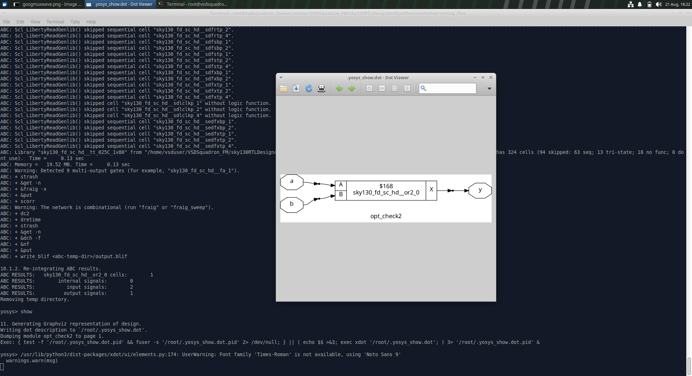


The optimized implementation shows the simplified combinational logic generated by the synthesis flow.

---

## 4.2 Optimization Check 2

### RTL Code

```verilog
module opt_check2 (input a, input b, output y);
assign y = a ? 1 : b;
endmodule
```

This RTL description is optimized during synthesis into a simplified combinational implementation.

### Optimized Logic Diagram


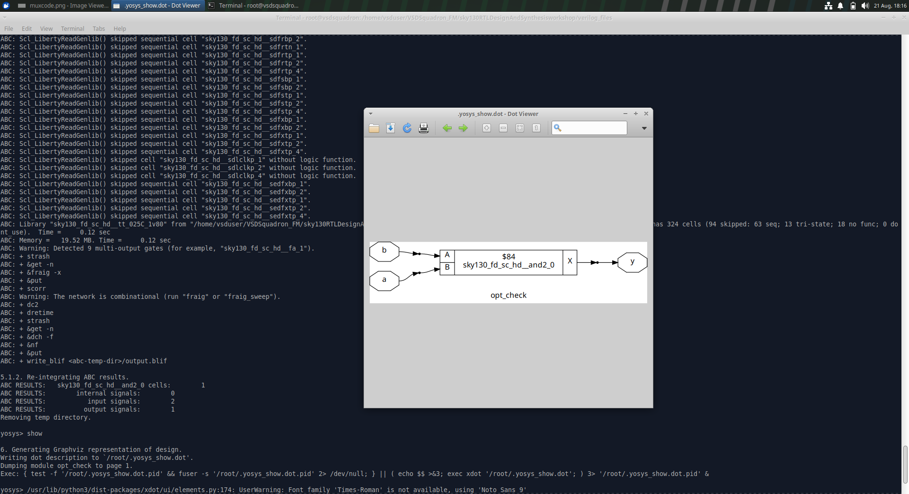


The synthesized implementation shows the optimized logic for `opt_check2`.

---

## 4.3 Optimization Check 3

### RTL Code

```verilog
module opt_check3 (input a, input b, input c, output y);
assign y = a ? (c ? b : 0) : 0;
endmodule
```

The synthesis tool analyzes the conditional logic and produces an optimized gate-level implementation.

### Optimized Logic Diagram


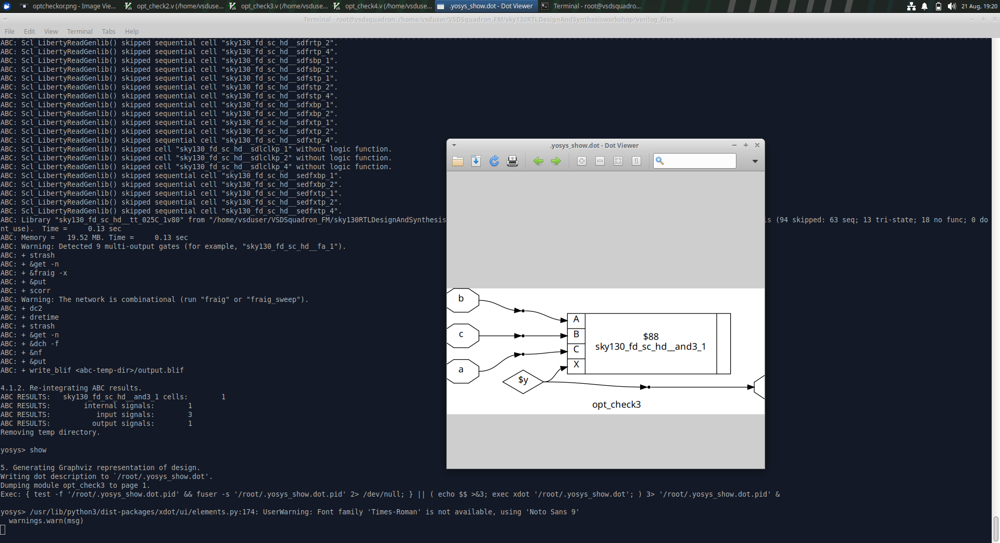


The diagram shows the synthesized implementation of `opt_check3`.

---

## 4.4 Optimization Check 4

### RTL Code

```verilog
module opt_check4 (input a, input b, input c, output y);
assign y = a ? (b ? (a & c) : 1) : (c ? 1 : 0);
endmodule
```

This example demonstrates optimization of a more complex combinational expression.

### Optimized Logic Diagram


The synthesized circuit shows the optimized implementation produced from the RTL description.

---

# 5. DFF Constant Optimizations

DFF constant optimization demonstrates how synthesis tools identify flip-flops whose outputs become constant values.

A register may initially appear as a sequential element in RTL, but if its value is always forced to a constant, the synthesis tool can simplify or remove the unnecessary sequential hardware.

Four DFF constant experiments were performed.

---

# 5.1 DFF Constant 1

## RTL Code

```verilog
module dff_const1(input clk, input reset, output reg q);
always @(posedge clk, posedge reset)
begin
    if(reset)
        q <= 1'b1;
    else
        q <= 1'b1;
end
endmodule
```

In this design, `q` is assigned `1'b1` in both the reset and normal operating conditions.

Therefore, the output remains constant.

The synthesis tool can identify that the flip-flop is unnecessary for generating the constant output.

## Optimized Diagram


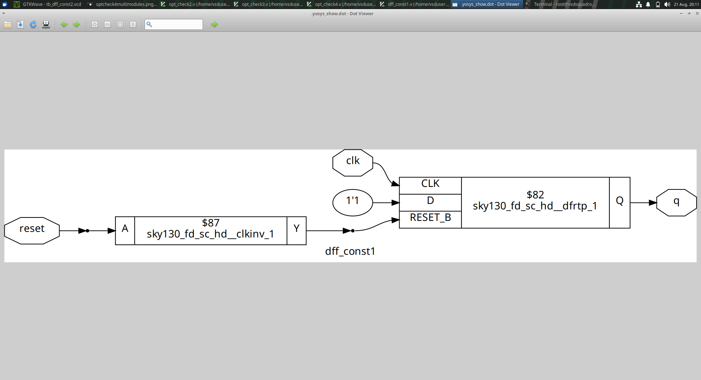


The optimized diagram shows the constant value driving the output instead of retaining unnecessary sequential logic.

## Waveform


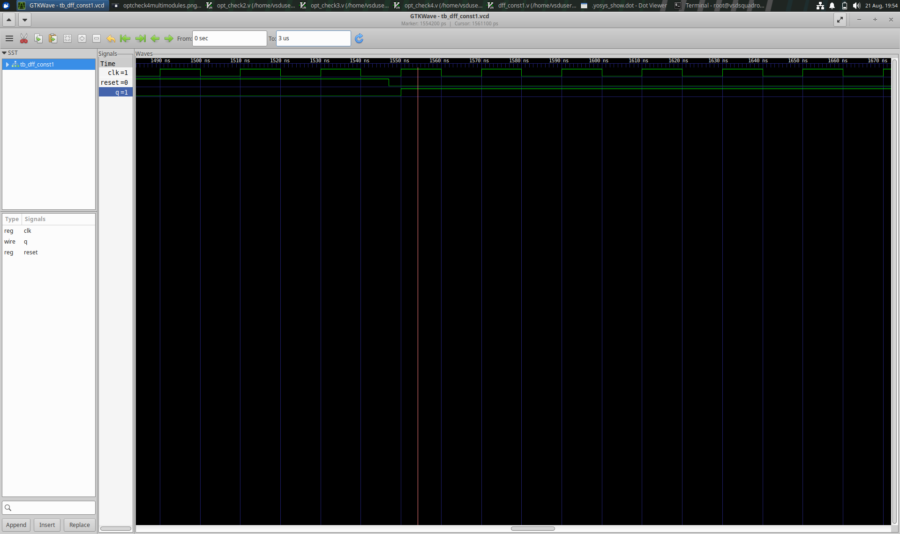


The waveform demonstrates the constant behavior of the output.

---

# 5.2 DFF Constant 2

## RTL Code

```verilog
module dff_const2(input clk, input reset, output reg q);
always @(posedge clk, posedge reset)
begin
    if(reset)
        q <= 1'b1;
    else
        q <= 1'b0;
end
endmodule
```

This example contains different values for reset and normal operation.

The synthesis flow analyzes the sequential behavior and produces an optimized implementation.

## Optimized Diagram


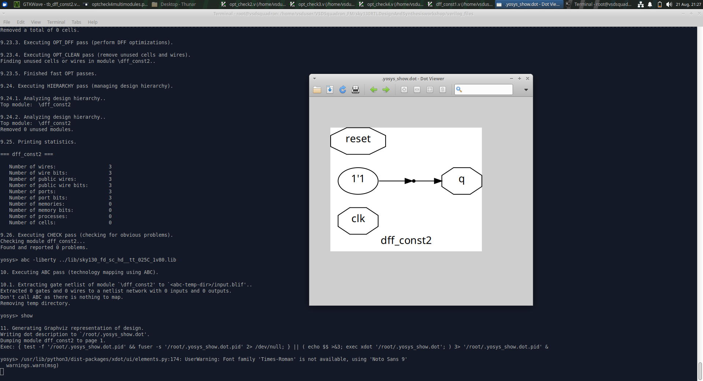


The optimized result shows the simplified implementation generated by synthesis.

## Waveform


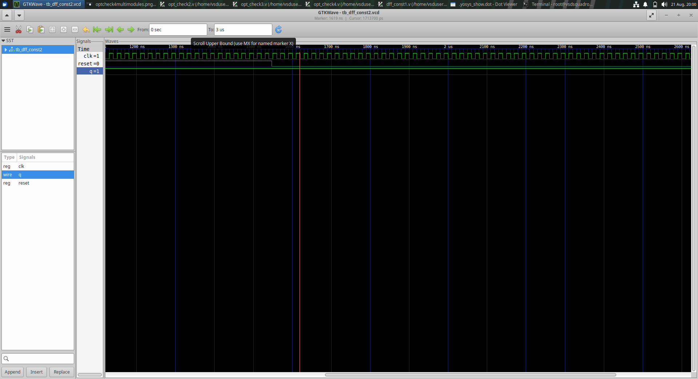


The waveform verifies the behavior of the design with respect to the clock and reset signals.

---

# 5.3 DFF Constant 3

## RTL Code

```verilog
module dff_const3(input clk, input reset, output reg q);
reg q1;

always @(posedge clk, posedge reset)
begin
    if(reset)
    begin
        q1 <= 1'b1;
        q <= 1'b0;
    end
    else
    begin
        q1 <= 1'b1;
        q <= q1;
    end
end
endmodule
```

This example contains an internal register `q1`.

The synthesis tool analyzes the constant assignment to `q1` and determines how the sequential logic can be simplified.

## Optimized Diagram


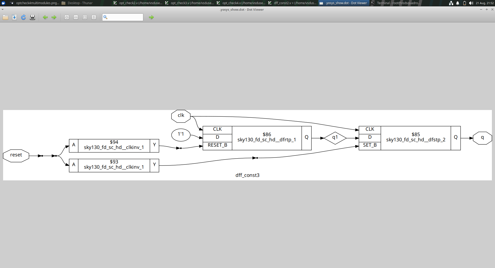


The optimized diagram demonstrates the synthesized sequential implementation.

## Waveform


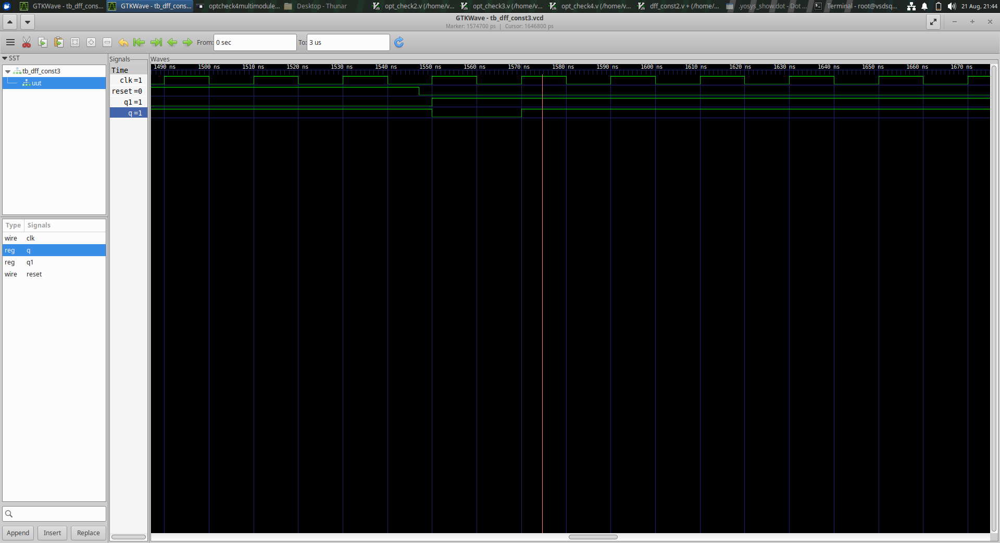


The waveform verifies the clock, reset and output behavior.

---

# 5.4 DFF Constant 4

## RTL Code

```verilog
module dff_const4(input clk, input reset, output reg q);
reg q1;

always @(posedge clk, posedge reset)
begin
    if(reset)
    begin
        q1 <= 1'b1;
        q <= 1'b1;
    end
    else
    begin
        q1 <= 1'b1;
        q <= q1;
    end
end
endmodule
```

Both `q1` and the output are driven toward constant values.

The synthesis tool can therefore identify unnecessary sequential elements and simplify the implementation.

## Optimized Diagram


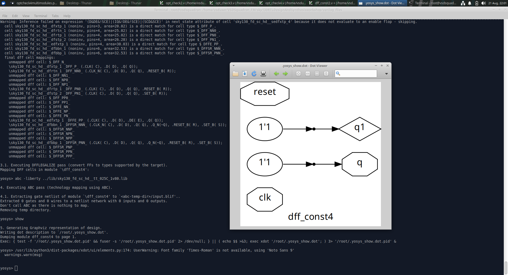


The optimized diagram shows the simplified implementation generated by the synthesis tool.

## Waveform


The waveform verifies the behavior of the optimized sequential logic.

---

# 6. Unused Output Optimization

Unused output optimization is another important synthesis optimization.

If a signal, register or logic cone does not contribute to any required output, the synthesis tool can identify it as unnecessary.

Such logic can be removed during optimization.

Removing unused logic helps to:

* Reduce circuit area
* Reduce unnecessary gates
* Reduce switching activity
* Simplify the synthesized netlist
* Improve hardware efficiency

The optimization checks in this module also demonstrate how synthesis identifies logic that is not required for the final output.

---

# 7. Counter Optimization

A counter is a sequential circuit that changes its stored value according to clock events.

The counter example uses a 3-bit register.

## RTL Code

```verilog
module counter_opt(input clk, input reset, output q);
reg [2:0] count;

assign q = count[2];

always @(posedge clk, posedge reset)
begin
    if(reset)
        count <= 3'b000;
    else
        count <= count + 1;
end
endmodule
```

The counter starts from zero when reset is asserted.

On every positive edge of the clock, the counter increments by one.

Only the most significant bit, `count[2]`, is connected to the output.

This allows the synthesis tool to analyze whether all counter bits are actually required for the final output.

## Optimized Logic Diagram


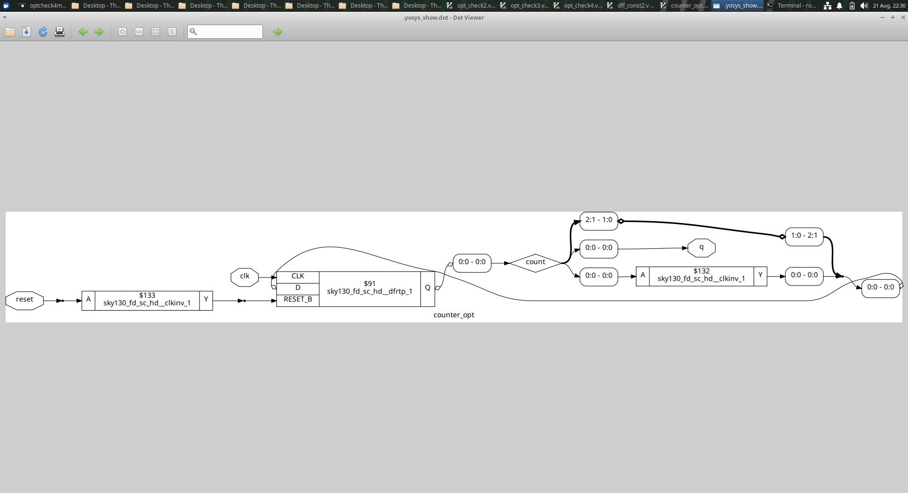


The diagram shows the synthesized counter implementation and the logic required to generate the output.

---

# 8. Counter Optimization 2

The second counter optimization example checks the counter value against a constant.

## RTL Code

```verilog
module counter_opt(input clk, input reset, output q);
reg [2:0] count;

assign q = (count[2:0] == 3'b100);

always @(posedge clk, posedge reset)
begin
    if(reset)
        count <= 3'b000;
    else
        count <= count + 1;
end
endmodule
```

The counter is reset to zero and increments on every positive edge of the clock.

The output becomes active when the counter reaches the specified constant value.

The synthesis tool can optimize the counter and comparison logic based on which bits are actually required to generate the output.

## Optimized Logic Diagram


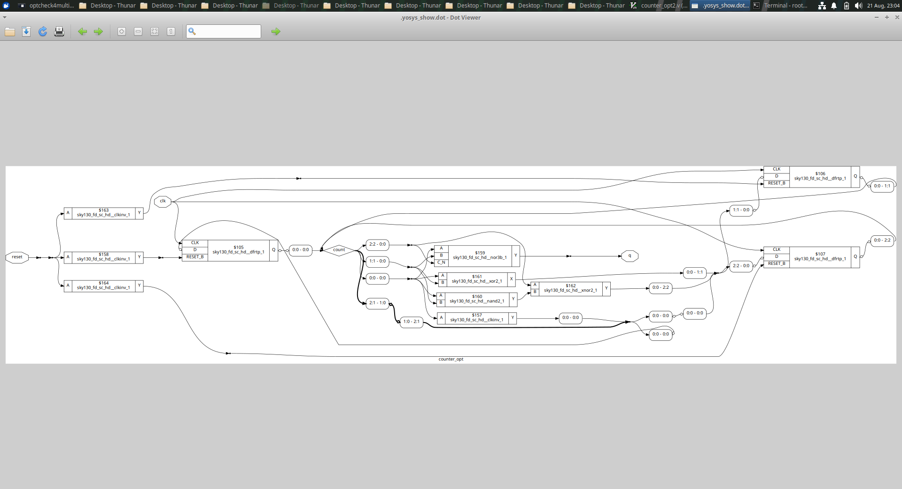


The diagram shows the optimized implementation of the counter and comparison logic.

---

# 9. Verification

The designs were checked using simulation and synthesis tools.

The verification process included:

* RTL implementation
* Simulation
* Waveform observation
* Synthesis
* Optimized logic/netlist inspection

The waveform screenshots demonstrate the simulated behavior of the sequential designs.

The synthesized diagrams demonstrate how the RTL was transformed into optimized hardware.


# 10. Conclusion

Module 3 demonstrates the importance of optimization in digital hardware design.

The experiments cover both **combinational and sequential logic optimization** and show how synthesis tools can identify redundant or unnecessary hardware.

The optimization checks demonstrate simplification of combinational logic.

The DFF constant experiments demonstrate how constant-driven sequential logic can be simplified.

The counter experiments demonstrate how synthesis can optimize sequential logic based on the actual outputs and required functionality.

Overall, this module provides practical experience with:

* RTL optimization
* Combinational logic optimization
* Sequential logic optimization
* Constant propagation
* DFF optimization
* Unused logic removal
* Counter optimization
* Synthesis
* Gate-level/netlist inspection
* Waveform verification

The screenshots included in this repository provide visual evidence of the synthesis and optimization results for the completed experiments.

---

## Module 3 Completed

**Topics Covered:**

* Introduction to Logic Optimizations
* Combinational Logic Optimization
* Sequential Logic Optimization
* Optimization Check 1
* Optimization Check 2
* Optimization Check 3
* Optimization Check 4
* DFF Constant 1
* DFF Constant 2
* DFF Constant 3
* DFF Constant 4
* Unused Output Optimization
* Counter Optimization
* Counter Optimization 2
* Waveform Verification
* Optimized Logic Diagram Verification
