# Module 1 --- Verilog RTL Design, Testbench, Yosys & Icarus Verilog Simulation

## 1. Introduction

Module 1 establishes the basic RTL design and verification flow used
throughout the workshop.

The material supplied for this module covers:

-   Introduction to Verilog design and testbench
-   Design Under Test (DUT)
-   Testbench and stimulus
-   How simulation works
-   Icarus Verilog based simulation flow
-   VCD (Value Change Dump) generation
-   GTKWave waveform viewing
-   Yosys synthesis flow
-   Liberty library input
-   RTL-to-netlist conversion
-   Viewing the synthesized structure of the `good_mux`
-   Understanding how RTL moves toward implementation

The purpose of this README is to document the work **from the starting
environment setup through RTL coding, synthesis, simulation and waveform
observation**, using the actual screenshots supplied for Module 1.

------------------------------------------------------------------------

## 2. Module 1 Learning Path

The complete flow can be understood as:

``` text
Environment Setup
        ↓
Project / RTL Files
        ↓
Verilog RTL Design
        ↓
Testbench
        ↓
       ┌───────────────┐
       │ Verification  │
       │ Icarus + VCD  │
       │ + GTKWave     │
       └───────────────┘
        ↓
       Yosys
        ↓
Read RTL + Liberty
        ↓
Synthesis
        ↓
ABC / Technology Mapping
        ↓
Netlist / Synthesized Structure
```

### Overall RTL Design Flow

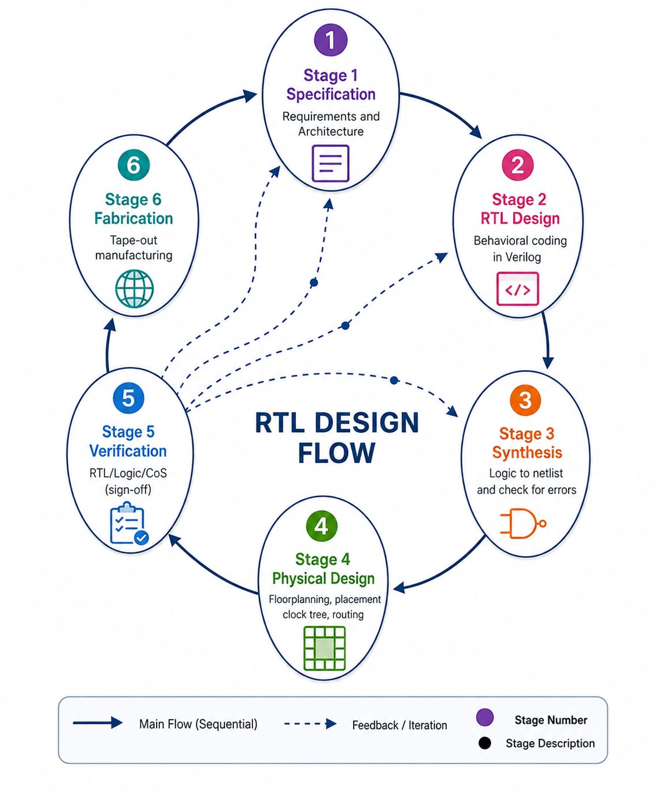

**Figure: RTL Design Flow**

This figure gives the high-level context for where RTL design, synthesis
and verification fit into the complete digital-design process.

------------------------------------------------------------------------

# 3. Lab 1 --- Environment Setup and Project Structure

## Objective

The first step is to prepare the working environment and locate the
workshop files.

The supplied terminal screenshot shows the Linux environment running
inside VirtualBox and the workshop directory being accessed.

## 3.1 Entering the Working Environment

The terminal is used to move through the Linux file system.

Typical commands used in the demonstrated flow include:

``` bash
sudo -i
cd /home
cd vsduser
cd VSDSquadron_FM
ls
```

The screenshot shows the working directory containing the
workshop/project area.

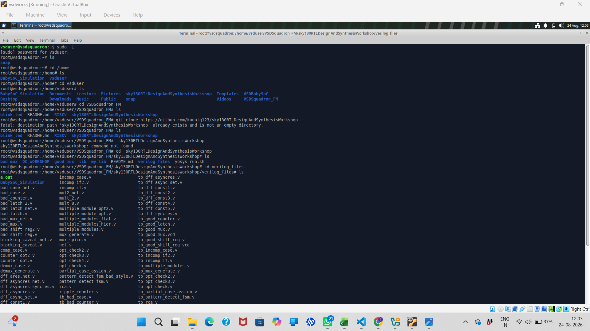

**Figure 1 --- Environment setup and project directory**

### What this figure demonstrates

The screenshot shows:

-   Linux terminal environment
-   transition to the `root` shell using `sudo -i`
-   movement into `/home`
-   movement into the `vsduser` directory
-   the `VSDSquadron_FM` project directory
-   the `sky130RTLDesignAndSynthesisWorkshop` directory
-   the `verilog_files` directory containing RTL and testbench sources

This establishes the starting point for the remaining experiments.

------------------------------------------------------------------------

## 3.2 Project Files

Inside the workshop's Verilog directory, many RTL and testbench examples
are available.

Examples visible in the supplied screenshot include:

``` text
good_mux.v
good_counter.v
good_latch.v
bad_mux.v
bad_counter.v
counter_opt.v
ripple_counter.v
tb_good_mux.v
tb_good_counter.v
tb_good_latch.v
tb_good_mux.vcd
...
```

This is useful because the workshop contains both design examples and
their corresponding testbenches.

### Important observation

A hardware design file and its testbench are separate pieces of the
verification environment.

For example:

``` text
good_mux.v
    +
tb_good_mux.v
    ↓
Simulation
    ↓
tb_good_mux.vcd
```

------------------------------------------------------------------------

# 4. Lab 2 --- Understanding the Design and Testbench

## Objective

The next step is to understand how a Verilog design is connected to a
testbench.

The supplied `TEST BENCH` figure represents the fundamental relationship
between stimulus generation, the design and output observation.

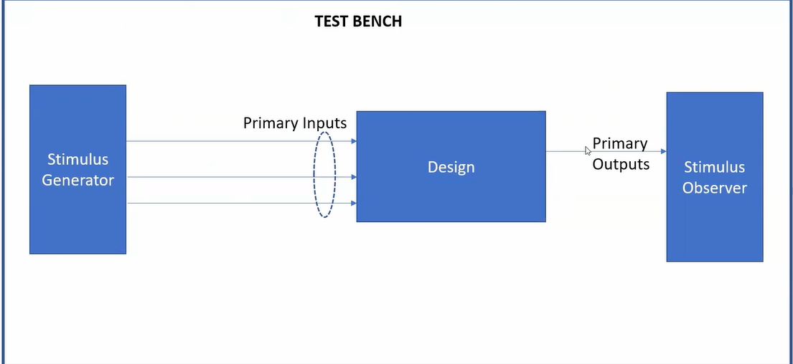

**Figure 2 --- Testbench structure**

The testbench can be understood as three main blocks:

``` text
Stimulus Generator
        ↓
      Design
        ↓
Stimulus Observer
```

### Stimulus Generator

The stimulus generator produces the input conditions that are applied to
the design.

For a multiplexer, these include:

-   `i0`
-   `i1`
-   `sel`

### Design

The design is the RTL module being tested.

In this module, the main example is:

``` text
good_mux
```

### Stimulus Observer

The output of the design is observed to determine whether the design
behaves as intended.

For the multiplexer, the main output is:

``` text
y
```

------------------------------------------------------------------------

# 5. Lab 2 --- `good_mux` Design

## 5.1 Multiplexer Concept

The `good_mux` example contains:

``` text
i0  → input 0
i1  → input 1
sel → selection signal
y   → output
```

The basic behavior is:

``` text
if sel = 0
    y = i0

if sel = 1
    y = i1
```

The design structure generated from the RTL is shown below.

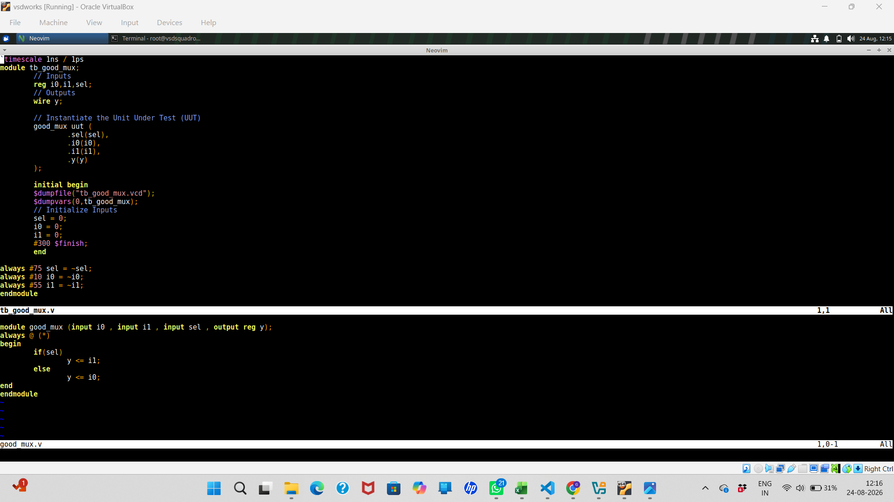

**Figure 3 --- Synthesized/design structure of `good_mux`**

The figure shows:

-   input `i0`
-   input `i1`
-   select `sel`
-   output `y`
-   a synthesized multiplexer cell represented as `$_MUX_`

The important point is that the RTL description can be transformed into
a lower-level hardware representation.

------------------------------------------------------------------------

## 5.2 MUX Design Diagram

The supplied MUX diagram gives another view of the same hardware
relationship.


**Figure 4 --- `good_mux` functional structure**

The three input-side signals enter the multiplexer:

``` text
i0 ──→ A
i1 ──→ B
sel ─→ S
```

and the selected value appears at:

``` text
Y ──→ y
```

This makes the relationship between the RTL ports and the hardware
structure easier to understand.

------------------------------------------------------------------------

# 6. Lab 2 --- Verilog RTL

The actual RTL implementation shown in the supplied editor screenshot
is:

``` verilog
module good_mux (input i0, input i1, input sel, output reg y);
always @(*)
begin
    if(sel)
        y <= i1;
    else
        y <= i0;
end
endmodule
```

### Explanation

### Module declaration

``` verilog
module good_mux (...);
```

defines the module named `good_mux`.

### Inputs

``` verilog
input i0;
input i1;
input sel;
```

The two data inputs are `i0` and `i1`, while `sel` determines which
input is selected.

### Output

``` verilog
output reg y;
```

The output `y` is declared as a `reg` because it is assigned inside the
procedural `always` block.

### Combinational process

``` verilog
always @(*)
```

indicates that the block is intended to respond whenever one of its
relevant input signals changes.

### Selection logic

``` verilog
if(sel)
    y <= i1;
else
    y <= i0;
```

Therefore:

``` text
sel = 1 → y = i1
sel = 0 → y = i0
```

------------------------------------------------------------------------

# 7. Lab 2 --- Testbench for `good_mux`

The supplied testbench screenshot shows the testbench module and the DUT
instantiation.


The testbench declares:

``` verilog
reg i0, i1, sel;
wire y;
```

and instantiates the Unit Under Test:

``` verilog
good_mux uut (
    .sel(sel),
    .i0(i0),
    .i1(i1),
    .y(y)
);
```

The testbench therefore connects:

``` text
testbench sel → DUT sel
testbench i0  → DUT i0
testbench i1  → DUT i1
DUT y         → testbench y
```

------------------------------------------------------------------------

## 7.1 VCD Dumping in the Testbench

The supplied testbench includes:

``` verilog
$dumpfile("tb_good_mux.vcd");
$dumpvars(0, tb_good_mux);
```

These statements are important because they create the waveform database
used later by GTKWave.

The flow is:

``` text
Testbench
    ↓
$dumpfile()
    ↓
VCD file
    ↓
GTKWave
```

------------------------------------------------------------------------

## 7.2 Test Stimulus

The testbench initializes the inputs:

``` verilog
sel = 0;
i0  = 0;
i1  = 0;
```

and later changes the values using timed `always` blocks.

The supplied code shows:

``` verilog
always #75 sel = ~sel;
always #10 i0  = ~i0;
always #55 i1  = ~i1;
```

This creates changing input conditions so that the multiplexer can be
observed over simulation time.

The testbench finishes with:

``` verilog
#300 $finish;
```

Therefore the simulation runs for the specified duration and then
terminates.

------------------------------------------------------------------------

# 8. Lab 3 --- Icarus Verilog Simulation Flow

## Objective

The next stage is to compile and simulate the RTL and testbench using
Icarus Verilog.

The supplied flow diagram summarizes this process.


**Figure 5 --- Icarus Verilog based simulation flow**

The flow is:

``` text
DESIGN
   +
TEST BENCH
   ↓
iverilog
   ↓
VCD file
   ↓
gtkwave
   ↓
Waveform
```

This is one of the central flows demonstrated in Module 1.

------------------------------------------------------------------------

# 9. Compiling the Design and Testbench

The supplied terminal screenshot shows the compilation command:

``` bash
iverilog good_mux.v tb_good_mux.v
```

This combines:

``` text
good_mux.v
```

and:

``` text
tb_good_mux.v
```

to create the simulation executable.

In the demonstrated environment the resulting executable is:

``` text
a.out
```

### Concept

`iverilog` performs the compilation/elaboration needed to create a
runnable simulation from the RTL and testbench.

``` text
RTL source
     +
Testbench source
     ↓
  iverilog
     ↓
   a.out
```

------------------------------------------------------------------------

# 10. Running the Simulation

The generated simulation executable is run with:

``` bash
./a.out
```

The supplied screenshot shows the simulation executing and the VCD file
being opened afterward
.


**Figure 6 --- Icarus Verilog compilation, simulation and GTKWave
command flow**

The terminal output includes:

``` text
VCD info: dumpfile tb_good_mux.vcd opened for output.
tb_good_mux.v:23: $finish called at 300000 (1ps)
```

This confirms two important things:

1.  The VCD dump file was successfully opened.
2.  The simulation reached `$finish`.

------------------------------------------------------------------------

# 11. VCD --- Value Change Dump

The VCD file generated in this experiment is:

``` text
tb_good_mux.vcd
```

A VCD file records signal-value changes during simulation.

The relationship is:

``` text
RTL + Testbench
       ↓
   Simulation
       ↓
Signal transitions
       ↓
   tb_good_mux.vcd
```

This file can then be loaded into GTKWave.

------------------------------------------------------------------------

# 12. GTKWave

The generated VCD is opened using:

``` bash
gtkwave tb_good_mux.vcd
```
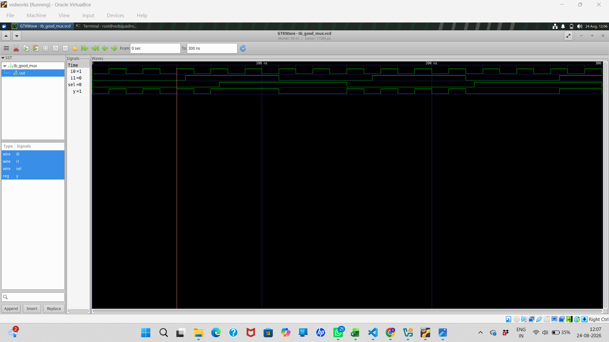

GTKWave is then used to inspect the signal transitions graphically.

The important signals for the `good_mux` experiment are:

``` text
i0
i1
sel
y
```

### What to verify

The waveform should be used to verify the functional relationship:

``` text
sel = 0 → y follows i0

sel = 1 → y follows i1
```

The waveform is therefore not merely a picture; it is evidence that the
RTL behavior has been simulated.

------------------------------------------------------------------------

# 13. Lab 3 --- Complete Simulation Flow

The complete experiment can now be represented as:

``` text
              good_mux.v
                   │
                   │
                   ├──────────────┐
                   │              │
                   ▼              ▼
             Verilog RTL     tb_good_mux.v
                                  │
                                  ▼
                             iverilog
                                  │
                                  ▼
                                a.out
                                  │
                                  ▼
                              ./a.out
                                  │
                                  ▼
                         tb_good_mux.vcd
                                  │
                                  ▼
                         gtkwave tb_good_mux.vcd
                                  │
                                  ▼
                         Waveform Analysis
```

The supplied presentation figure shows the same concept visually.

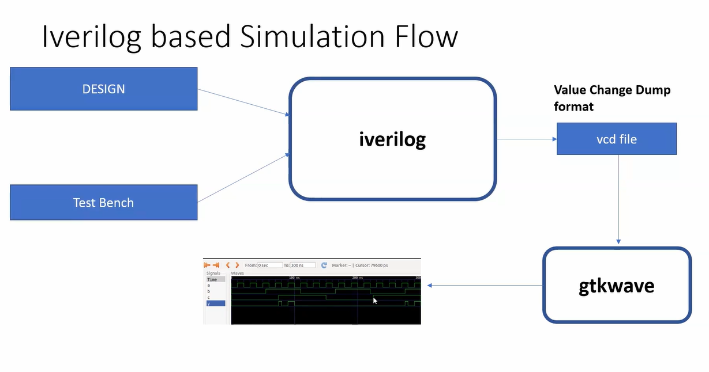

------------------------------------------------------------------------

# 14. Yosys Setup

Module 1 also introduces the Yosys synthesis flow.

The supplied Yosys setup figure shows the main inputs and outputs:

``` text
DESIGN ───────────────┐
                      │
                      ▼
                    yosys
                      │
.lib ────────────────►│
                      │
                      ▼
                netlist file
```

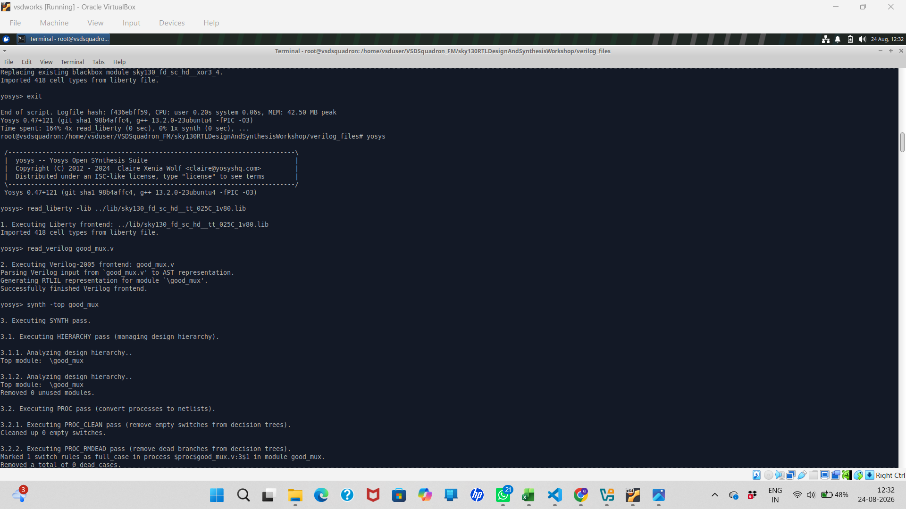

**Figure 7 --- Yosys setup and synthesis inputs/outputs**

The figure identifies the following Yosys commands/concepts:

-   `read_verilog`
-   `read_liberty`
-   `write_verilog`

The `.lib` file provides the technology library information used during
technology-aware synthesis/mapping.

------------------------------------------------------------------------

# 15. Invoking Yosys

The supplied terminal screenshot shows Yosys being launched from the
Verilog files directory.

The Yosys prompt appears as:

``` text
yosys>
```

The first important library command shown is:

``` text
read_liberty -lib ./lib/sky130_fd_sc_hd__tt_025C_1v80.lib
```

Yosys reports:

``` text
Imported 418 cell types from liberty file.
```

This means the Liberty library has been read and its available cell
types have been made available to the synthesis flow.

------------------------------------------------------------------------

# 16. Reading the RTL into Yosys

The next command shown is:

``` text
read_verilog good_mux.v
```

Yosys then reports that it is parsing the Verilog input and generating
an RTL intermediate representation for:

``` text
good_mux
```

The terminal output indicates:

``` text
Successfully finished Verilog frontend.
```

This establishes the first major Yosys step:

``` text
good_mux.v
    ↓
read_verilog
    ↓
Yosys RTL representation
```

------------------------------------------------------------------------

# 17. Synthesis in Yosys

The supplied terminal screenshot then shows:

``` text
synth -top good_mux
```

This tells Yosys that:

``` text
good_mux
```

is the top-level module for synthesis.

The output shows synthesis passes such as:

``` text
Executing SYNTH pass
Executing HIERARCHY pass
Analyzing design hierarchy
Executing PROC pass
Executing PROC_CLEAN pass
Executing PROC_RMDEAD pass
```

These are internal stages of the Yosys synthesis process.

The important conceptual flow is:

``` text
Verilog RTL
    ↓
Read / parse RTL
    ↓
RTL representation
    ↓
Synthesis passes
    ↓
Optimized logic representation
```

------------------------------------------------------------------------

# 18. ABC Technology Mapping

The supplied terminal result shows Yosys executing ABC.

The displayed commands include:

``` text
read_blif <abc-temp-dir>/input.blif
read_library <abc-temp-dir>/stdcells.genlib
strash
dretime
map
write_blif <abc-temp-dir>/output.blif
```

ABC is therefore being used as part of the technology-mapping stage.

The result shown in the supplied screenshot is:

``` text
ABC RESULTS:
    MUX cells:        1
    internal signals: 0
    input signals:    3
    output signals:   1
```

This is particularly useful for the `good_mux` example because it
demonstrates that the design has been recognized and mapped as a
multiplexer.

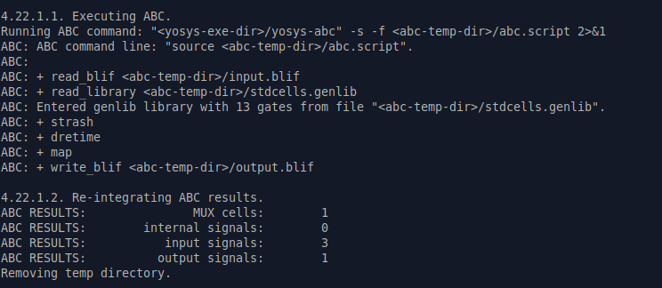

**Figure 8 --- ABC synthesis/mapping result**

### Interpretation

The result indicates:

-   **MUX cells = 1** → one multiplexer cell is present in the mapped
    result.
-   **Internal signals = 0** → no additional internal signal is reported
    in this result.
-   **Input signals = 3** → `i0`, `i1` and `sel`.
-   **Output signals = 1** → `y`.

This agrees with the logical structure of the `good_mux`.

------------------------------------------------------------------------

# 19. Synthesized `good_mux` Structure

The synthesized structure shown in the supplied figure contains:

``` text
i0 ─────┐
        │
i1 ─────┤
        │
sel ────┤
        ▼
      $_MUX_
        │
        ▼
        y
```
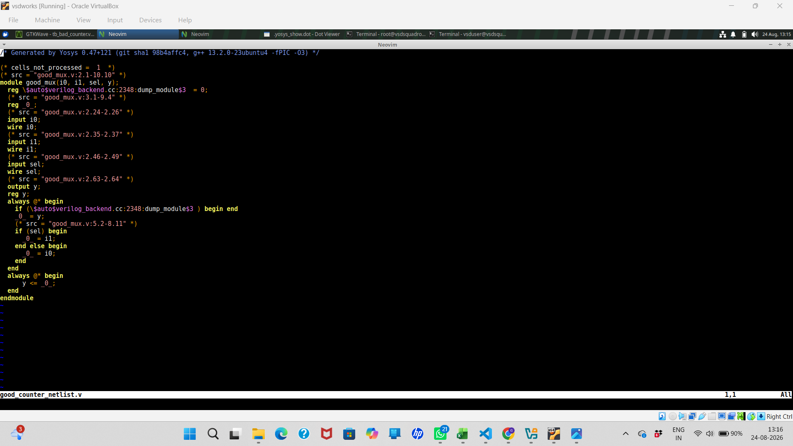

The `$ _MUX_` representation demonstrates how the high-level RTL
conditional selection can be represented as a hardware multiplexer cell.

------------------------------------------------------------------------

# 20. RTL Simulation vs Synthesis

It is important to distinguish the two flows used in Module 1.

## Simulation

Simulation asks:

> **Does the RTL behave as intended for the applied stimulus?**

``` text
RTL + Testbench
       ↓
   Icarus Verilog
       ↓
       VCD
       ↓
    GTKWave
       ↓
Behavior verification
```

## Synthesis

Synthesis asks:

> **What hardware structure can be produced from the RTL?**

``` text
RTL
 ↓
Yosys
 ↓
Synthesis
 ↓
ABC / technology mapping
 ↓
Mapped hardware / netlist
```

Both are important, but they answer different questions.

------------------------------------------------------------------------

# 21. Yosys Command Flow

The commands demonstrated in the supplied screenshots can be summarized
as:

``` text
yosys

read_liberty -lib <sky130 liberty file>

read_verilog good_mux.v

synth -top good_mux

# ABC / mapping is invoked by the synthesis flow
```

The exact library path shown in the experiment is:

``` text
./lib/sky130_fd_sc_hd__tt_025C_1v80.lib
```

The important sequence is:

``` text
Read technology library
        ↓
Read RTL
        ↓
Select top module
        ↓
Synthesize
        ↓
Technology mapping
        ↓
Observe mapped result
```

------------------------------------------------------------------------

# 22. Figures Used in Module 1

All supplied figures have been assigned a purpose in the documentation.

  ---------------------------------------------------------------------------------
  Figure             File                                     Purpose
  ------------------ ---------------------------------------- ---------------------
  1                  `environment_setup.png`                  Initial Linux/project
                                                              environment

  2                  `test_bench.png`                         Testbench
                                                              architecture

  3                  `good_mux_rtl_structure.png`             Synthesized
                                                              `good_mux` structure

  4                  `design of mux.png`                      Functional MUX design

  5                  `iverilog_flow.png`                      Icarus simulation
                                                              flow

  6                  `iverilog_a.out_gtkwave_commands .png`   Compile/run/GTKWave
                                                              commands

  7                  `yosys.png`                              Yosys setup

  8                  `chara_cells.png`                        ABC mapped-cell
                                                              result

  9                  `invoke_yosys.png`                       RTL/testbench source
                                                              view and DUT
                                                              connection

  10                 `rtl_design_flow.jpeg`                   Overall RTL design
                                                              flow

| 11     | `design_good_counter-1.png`   | `good_counter` synthesized structure |
| 12     | `good_counter_waveform-1.png` | `good_counter` GTKWave waveform      |

  ---------------------------------------------------------------------------------


# 23. My Learning

This section is intentionally written as a place for **personal
learning**, rather than simply repeating the lecturer's explanation.

## What I learned from Module 1

### 1. RTL is the starting point

I learned that the hardware behavior is first described using RTL.

For the `good_mux`:

``` text
i0
i1
sel
 ↓
good_mux
 ↓
y
```

### 2. A testbench is necessary

The RTL describes the design, while the testbench provides stimulus and
observes the result.

``` text
Stimulus
   ↓
DUT
   ↓
Output
```

### 3. Simulation and synthesis are different

I learned that Icarus Verilog and GTKWave are used to observe simulated
behavior, while Yosys is used to synthesize the RTL into a
hardware-oriented representation.

### 4. VCD connects simulation to waveform analysis

The testbench creates:

``` text
tb_good_mux.vcd
```

and GTKWave reads this file to display signal transitions.

### 5. Synthesis can reveal the hardware structure

The Yosys/ABC result showed:

``` text
MUX cells: 1
```

and the generated structure represents the `good_mux` as a multiplexer
cell.

------------------------------------------------------------------------

# 24. Lab 4 --- `good_counter` Experiment

After completing the `good_mux` experiment, I applied the same RTL,
simulation and waveform-analysis flow to `good_counter`.

The experiment includes:

```text
good_counter RTL
       ↓
tb_good_counter.v
       ↓
Icarus Verilog
       ↓
VCD
       ↓
GTKWave
       ↓
Waveform verification
       ↓
Yosys synthesis
       ↓
Synthesized structure / netlist

# 24.1 `good_counter` Synthesized Structure

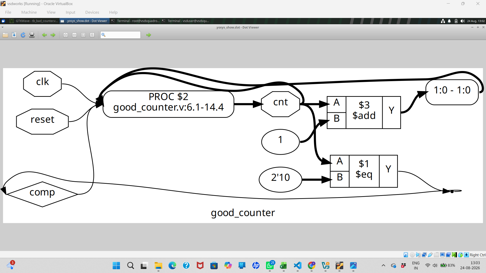

**Figure 11 --- Synthesized/design structure of `good_counter`**

The supplied synthesized structure shows:

- `clk`
- `reset`
- `cnt`
- an addition operation
- a comparison operation
- constant `1`
- comparison against `2'b10`
- feedback/control paths

The structure demonstrates that the counter RTL has been converted into
a hardware-oriented representation by Yosys.

---

### 24.2 `good_counter` GTKWave Simulation

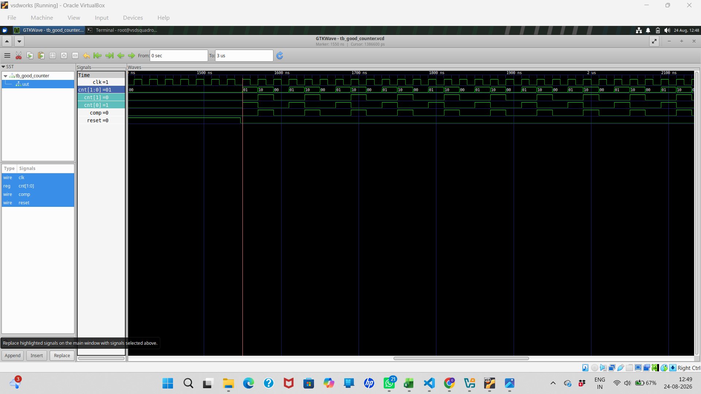

**Figure 12 --- `good_counter` waveform in GTKWave**

The waveform displays:

```text
clk
cnt[1:0]
cnt[1]
cnt[0]
comp
reset

------------------------------------------------------------------------

# 25. What I Would Do Differently / Improvements

After completing the basic flow, I can extend the work by:

-   adding more test cases to the MUX testbench,
-   checking all combinations of `i0`, `i1` and `sel`,
-   adding automatic checking of expected vs actual output,
-   creating a counter testbench,
-   observing counter waveforms in GTKWave,
-   synthesizing the counter with Yosys,
-   comparing synthesized structures,
-   investigating how RTL coding style changes synthesized hardware.

This turns the module from a demonstration into an independently
reproducible experiment.

------------------------------------------------------------------------

# 26. Key Takeaways

The most important Module 1 flow is:

``` text
                 RTL DESIGN
                     │
                     ▼
                 TESTBENCH
                     │
          ┌──────────┴──────────┐
          │                     │
          ▼                     ▼
      SIMULATION             SYNTHESIS
          │                     │
      iverilog                Yosys
          │                     │
          ▼                     ▼
         VCD                 ABC / Mapping
          │                     │
          ▼                     ▼
      GTKWave               Netlist / Cells
          │
          ▼
   Verify Behavior
```

For the `good_mux`, the final understanding is:

``` text
sel = 0 → y = i0
sel = 1 → y = i1
```

and the synthesis result confirms the presence of one mapped MUX cell.

------------------------------------------------------------------------

# 27. Module 1 Folder Structure

The recommended repository structure is:

``` text
Module_1/
│
├── README.md
│
├── RTL/
│   └── good_mux.v
│
├── Testbench/
│   └── tb_good_mux.v
│
├── Simulation/
│   └── tb_good_mux.vcd
│
├── Synthesis/
│   └── good_mux_netlist.v
│
├── images/
│   ├── environment_setup.png
│   ├── test_bench.png
│   ├── good_mux_rtl_structure.png
│   ├── design of mux.png
│   ├── iverilog_flow.png
│   ├── iverilog_a.out_gtkwave_commands .png
│   ├── yosys.png
│   ├── chara_cells.png
│   ├── invoke_yosys.png
│   └── rtl_design_flow.jpeg
│
└── Results/
    ├── simulation/
    └── synthesis/
```

> The `RTL/`, `Testbench/`, `Simulation/` and `Synthesis/` folders can
> be populated with the actual source/output files as you organize the
> repository. The README only documents the files and results that are
> supported by the material supplied so far.

------------------------------------------------------------------------

# 28. Module 1 Final Checklist

-   [x] Environment setup documented
-   [x] Project directory documented
-   [x] Testbench concept documented
-   [x] `good_mux` design documented
-   [x] RTL structure documented
-   [x] Testbench/DUT connection documented
-   [x] Icarus Verilog flow documented
-   [x] VCD generation documented
-   [x] GTKWave flow documented
-   [x] Yosys setup documented
-   [x] `read_liberty` documented
-   [x] `read_verilog` documented
-   [x] `synth -top good_mux` documented
-   [x] ABC mapping result documented
-   [x] MUX-cell result documented
-   [x] Personal learning section added
-   [x] Additional counter-learning section added
-   [x] Folder structure defined

------------------------------------------------------------------------

## Conclusion

Module 1 establishes the complete foundation:

**environment → RTL → testbench → simulation → VCD → GTKWave → synthesis
→ technology mapping.**

