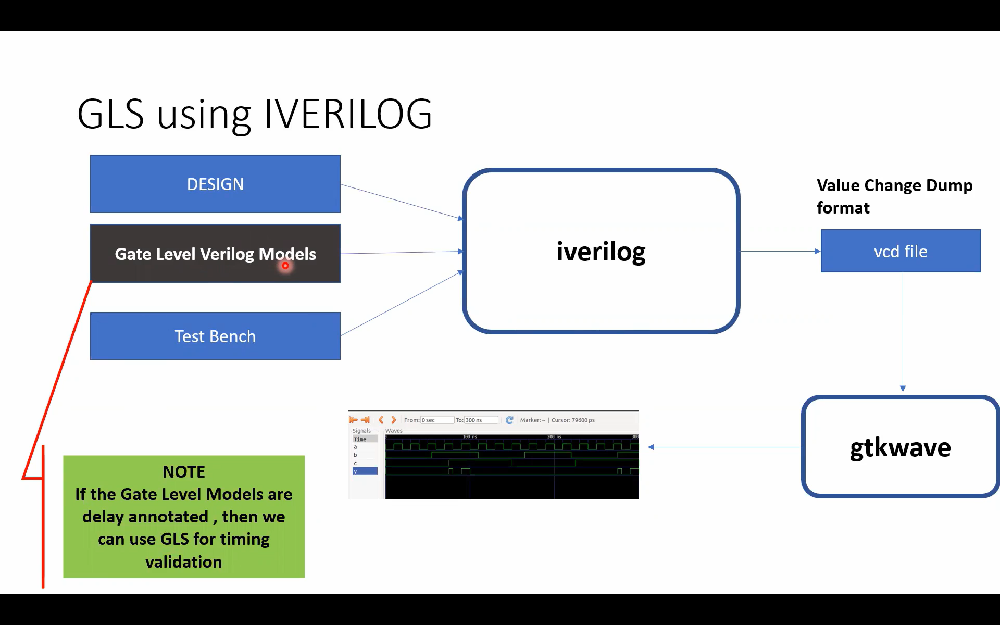
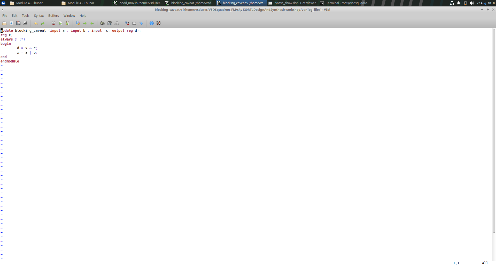
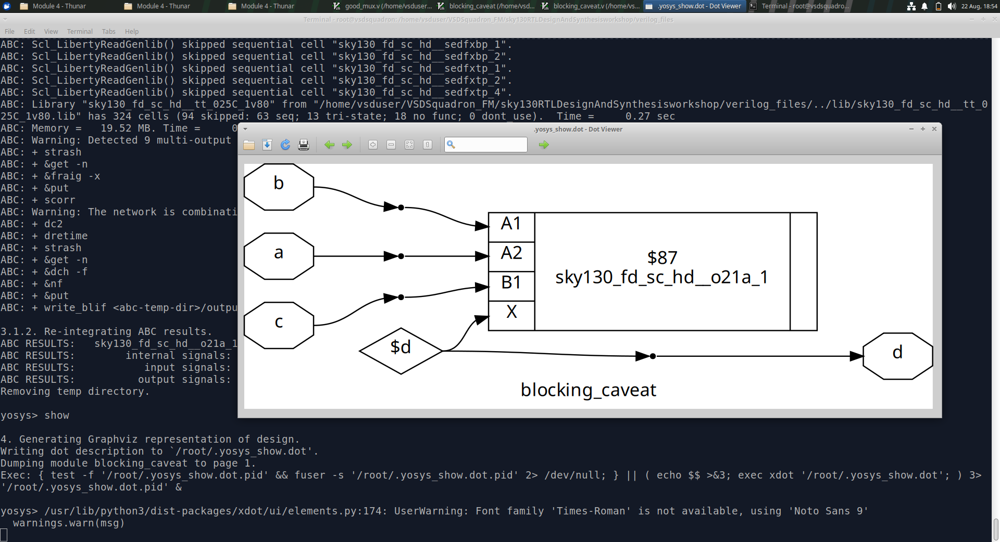
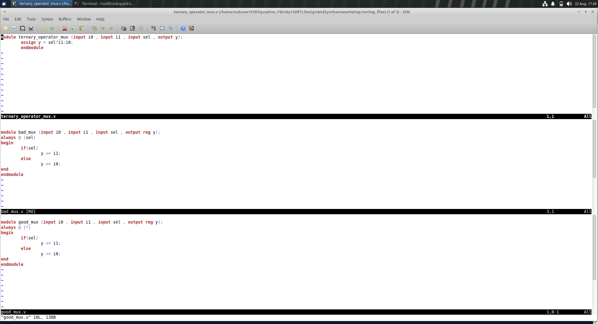
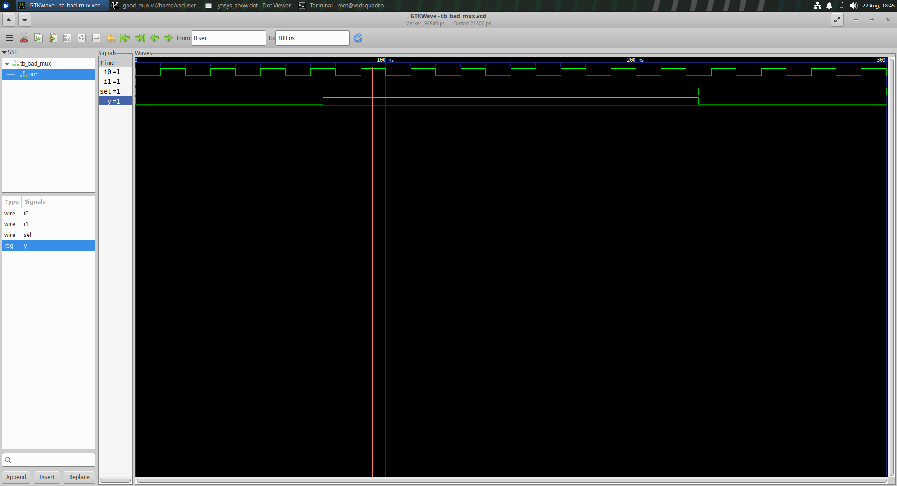
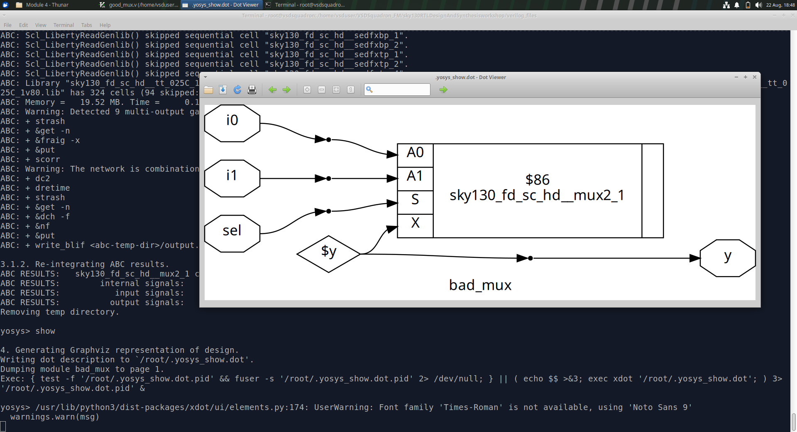
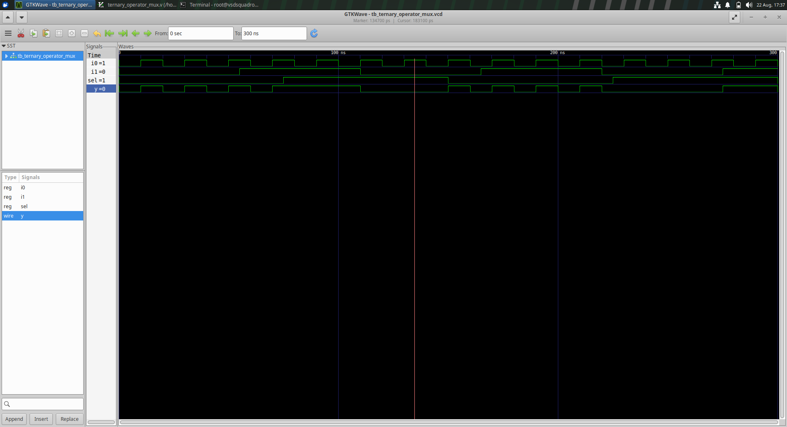
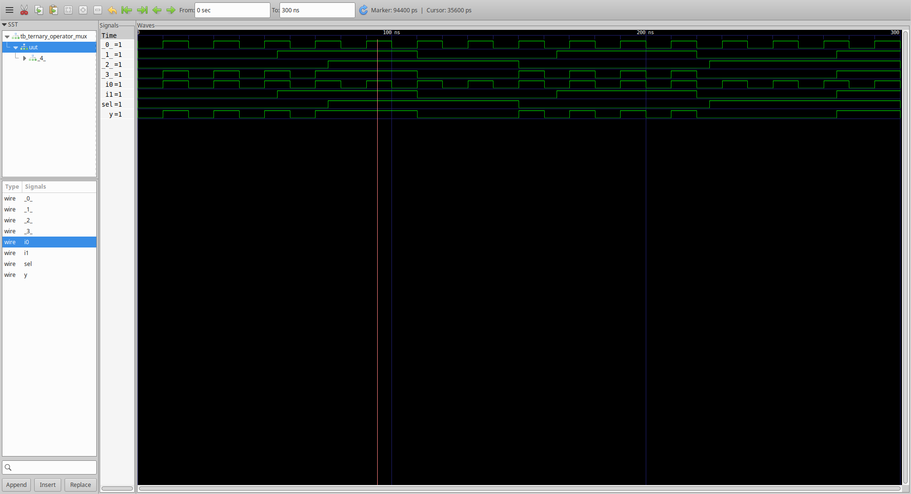
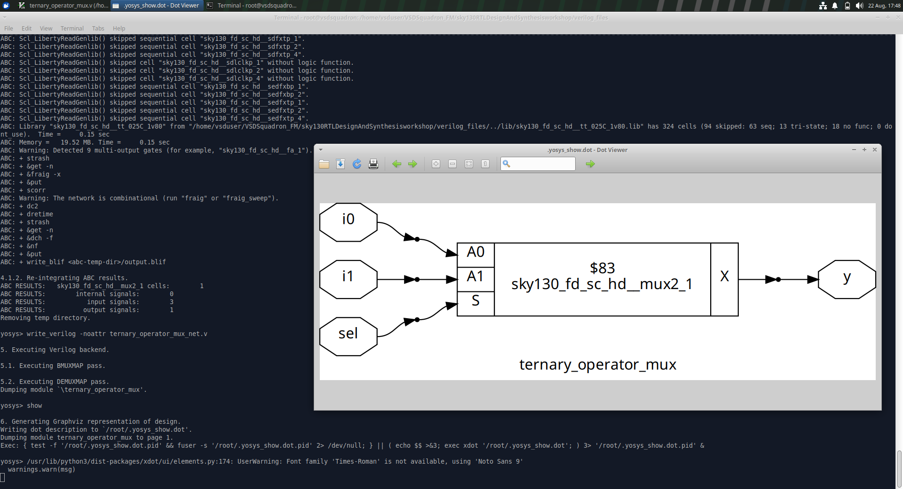

# Module 4: GLS, Blocking vs Non-Blocking and Synthesis-Simulation Mismatch

This repository contains the work completed for **Module 4 – Gate Level Simulation (GLS), Blocking vs Non-Blocking Statements and Synthesis-Simulation Mismatch**.

The module focuses on understanding Gate Level Simulation, the need for GLS, synthesis-simulation mismatches, Verilog blocking and non-blocking assignments, and the caveats associated with blocking statements.

---

## Table of Contents

* [1. Introduction](#1-introduction)
* [2. Introduction to Gate Level Simulation and Synthesis-Simulation Mismatches](#2-introduction-to-gate-level-simulation-and-synthesis-simulation-mismatches)
* [3. What is GLS](#3-what-is-gls)
* [4. Why is GLS Required](#4-why-is-gls-required)
* [5. GLS Using Icarus Verilog](#5-gls-using-icarus-verilog)
* [6. Synthesis-Simulation Mismatch](#6-synthesis-simulation-mismatch)
* [7. Blocking and Non-Blocking Statements in Verilog](#7-blocking-and-non-blocking-statements-in-verilog)

  * [Blocking Assignment](#71-blocking-assignment)
  * [Non-Blocking Assignment](#72-non-blocking-assignment)
* [8. Caveats with Blocking Statements](#8-caveats-with-blocking-statements)
* [9. Bad MUX and Good MUX](#9-bad-mux-and-good-mux)
* [10. Ternary Operator MUX](#10-ternary-operator-mux)
* [11. Verification](#11-verification)
* [12. Conclusion](#12-conclusion)

---

# 1. Introduction

Gate Level Simulation and synthesis-simulation mismatch analysis are important parts of RTL-to-hardware design.

RTL simulation verifies the behavior of the RTL description, while synthesis converts the RTL into a gate-level representation.

After synthesis, the actual gate-level implementation can contain:

* Standard cells
* Logic gates
* Multiplexers
* Buffers
* Inverters
* Sequential elements

Gate Level Simulation is used to simulate this synthesized representation and verify that the synthesized design behaves as expected.

This module also focuses on Verilog coding styles, especially the difference between **blocking (`=`)** and **non-blocking (`<=`)** assignments.

Incorrect use of these assignments can result in simulation behavior that does not correctly represent the intended hardware.

---

# 2. Introduction to Gate Level Simulation and Synthesis-Simulation Mismatches

A typical digital design flow consists of:

```text
RTL Design
    ↓
RTL Simulation
    ↓
Synthesis
    ↓
Gate-Level Netlist
    ↓
Gate Level Simulation
    ↓
Hardware Implementation
```

RTL simulation works with the behavioral RTL description.

Synthesis converts the RTL into a gate-level netlist using available standard-cell libraries.

Gate Level Simulation then verifies the synthesized netlist.

A synthesis-simulation mismatch occurs when the behavior observed during RTL simulation differs from the behavior observed after synthesis.

Such mismatches may be caused by:

* Incorrect RTL coding style
* Incomplete sensitivity lists
* Incorrect use of blocking assignments
* Incorrect use of non-blocking assignments
* Reset handling
* Timing-related behavior
* Unintended latches
* X propagation
* Differences between behavioral and synthesized implementation

---

# 3. What is GLS?

**GLS stands for Gate Level Simulation.**

Gate Level Simulation is the simulation of a synthesized gate-level netlist.

Instead of simulating only the RTL description, GLS simulates the actual gates and standard cells generated after synthesis.

A gate-level simulation generally uses:

* Synthesized gate-level Verilog netlist
* Gate-level standard-cell models
* Testbench
* Simulation tool

The purpose is to check whether the synthesized design behaves correctly.

---

# 4. Why is GLS Required?

Gate Level Simulation is useful because synthesis can transform the RTL into a different structural representation.

GLS helps identify issues that may not be visible during RTL simulation.

Important reasons for performing GLS include:

1. Verification of the synthesized netlist
2. Detection of synthesis-related functional issues
3. Detection of synthesis-simulation mismatches
4. Verification of reset behavior
5. Verification of optimized logic
6. Verification of standard-cell connectivity
7. Checking the behavior of the synthesized implementation

GLS becomes especially important when the design moves from RTL toward physical implementation.

---

# 5. GLS Using Icarus Verilog

The module demonstrates GLS using **Icarus Verilog (iverilog)**.

The basic GLS flow is:

```text
Design
   +
Gate Level Verilog Models
   +
Testbench
   ↓
iverilog
   ↓
VCD File
   ↓
GTKWave
```

The Value Change Dump (**VCD**) file contains the signal transitions generated during simulation.

GTKWave can then be used to observe these signal transitions as waveforms.

---

## GLS Using IVERILOG





The screenshot demonstrates the flow from the design and gate-level Verilog models through Icarus Verilog to the VCD waveform and GTKWave.

---

# 6. Synthesis-Simulation Mismatch

A synthesis-simulation mismatch occurs when the synthesized hardware does not behave in simulation in the same way that was expected from the RTL simulation.

The RTL may appear correct during functional simulation, but incorrect coding practices can cause synthesis to interpret the intended hardware differently.

Common causes include:

* Incomplete sensitivity lists
* Incorrect blocking assignments
* Incorrect non-blocking assignments
* Incomplete assignments in combinational logic
* Unintended latch inference
* Reset-related issues
* Race conditions
* X-state behavior
* Timing differences

Therefore, RTL coding style is very important for reliable synthesis and simulation.

---

# 7. Blocking and Non-Blocking Statements in Verilog

Verilog provides two major assignment types:

```text
Blocking Assignment      =
Non-Blocking Assignment  <=
```

The choice between them is important because they behave differently during simulation.

---

# 7.1 Blocking Assignment

A blocking assignment uses:

```verilog
=
```

Example:

```verilog
a = b;
```

The statement updates the left-hand-side variable immediately within the current procedural execution flow.

Blocking assignments are commonly used for combinational logic.

Example:

```verilog
always @(*)
begin
    y = a & b;
end
```

Here, the output `y` is calculated from the current values of `a` and `b`.

---

# 7.2 Non-Blocking Assignment

A non-blocking assignment uses:

```verilog
<=
```

Example:

```verilog
q <= d;
```

The update is scheduled rather than taking effect immediately during the current procedural execution.

Non-blocking assignments are commonly used for sequential logic such as flip-flops.

Example:

```verilog
always @(posedge clk)
begin
    q <= d;
end
```

This models a flip-flop whose output changes in response to a clock edge.

---

## Blocking vs Non-Blocking

| Feature            | Blocking `=`                   | Non-Blocking `<=`              |
| ------------------ | ------------------------------ | ------------------------------ |
| Assignment         | Immediate procedural update    | Scheduled update               |
| Common usage       | Combinational logic            | Sequential logic               |
| Typical block      | `always @(*)`                  | `always @(posedge clk)`        |
| Execution behavior | Statements execute in sequence | Updates occur after evaluation |
| Main concern       | Ordering and sensitivity       | Clocked/sequential behavior    |

---

# 8. Caveats with Blocking Statements

Blocking assignments can create simulation problems when they are used incorrectly.

One important issue is the ordering of statements.

Consider the following example:

```verilog
module blocking_caveat(input a, input b, input c, output reg d);
reg x;

always @(*)
begin
    x = a & c;
    d = x | b;
end

endmodule
```

Here, `x` is calculated first and then used to calculate `d`.

Because blocking assignment is used, the value assigned to `x` is available immediately for the next statement.

The order of statements therefore affects the behavior of the procedural block.

---

## Blocking Caveat Code Screenshot





---

## Blocking Caveat – Optimized/Synthesized Diagram




The synthesized diagram shows the hardware inferred from the RTL.

---

## Blocking Caveat – Waveform


The waveform demonstrates the simulation behavior of the blocking-caveat example.

---

# 9. Bad MUX and Good MUX

A multiplexer selects one of several inputs based on a select signal.

For a 2:1 MUX:

```text
sel = 0 → output = i0
sel = 1 → output = i1
```

The module demonstrates the difference between an incorrectly written sensitivity list and a correct combinational sensitivity list.

---

# 9.1 Bad MUX

The `bad_mux` example uses only `sel` in its sensitivity list.

```verilog
module bad_mux(input i0, input i1, input sel, output reg y);

always @(sel)
begin
    if(sel)
        y = i1;
    else
        y = i0;
end

endmodule
```

The problem is that changes in `i0` or `i1` do not trigger the `always` block.

Therefore, the simulation can fail to update the output when an input changes while `sel` remains unchanged.

This is an example of how an incomplete sensitivity list can lead to simulation behavior that does not correctly represent the intended combinational hardware.

---

## Bad MUX, Good MUX ,Ternary operator MUX – Code Screenshot

The bad MUX code appears together with the good MUX and ternary MUX code in the supplied screenshot.





---

## Bad MUX – Waveform





The waveform demonstrates the simulation behavior of the bad MUX.

---

## Bad MUX – Synthesized Diagram





The synthesized diagram demonstrates the hardware implementation inferred from the RTL.

---

# 9.2 Good MUX

The corrected MUX uses the complete combinational sensitivity list.

```verilog
module good_mux(input i0, input i1, input sel, output reg y);

always @(*)
begin
    if(sel)
        y = i1;
    else
        y = i0;
end

endmodule
```

The `@(*)` sensitivity list automatically includes the signals used by the combinational block.

Therefore, changes in `i0`, `i1`, or `sel` cause the block to execute.

This is the preferred style for combinational logic written using an `always` block.

---

# 10. Ternary Operator MUX

The same 2:1 MUX can also be written using the ternary operator.

```verilog
module ternary_operator_mux(input i0, input i1, input sel, output y);

assign y = sel ? i1 : i0;

endmodule
```

The expression:

```text
sel ? i1 : i0
```

means:

```text
If sel = 1 → y = i1
If sel = 0 → y = i0
```

The ternary operator provides a compact way of describing combinational selection logic.

---

## Ternary MUX – Waveform 1





---

## Ternary MUX – Waveform 2




The waveforms demonstrate the relationship between the MUX inputs, select signal and output.

---

## Ternary MUX – Synthesized Diagram





The synthesized diagram demonstrates that the ternary operator is implemented as MUX hardware.

---

# 11. Verification

The experiments in this module were verified using simulation and synthesis tools.

The verification process included:

1. Writing the RTL code
2. Simulating the RTL
3. Observing the waveform
4. Synthesizing the RTL
5. Inspecting the synthesized logic
6. Performing gate-level simulation
7. Comparing simulation behavior with synthesized behavior

---

## Screenshot Organization

All screenshots are kept in one `images` folder to keep the repository clean.

| Screenshot    | Experiment                          | File Name                      |
| ------------- | ----------------------------------- | ------------------------------ |
| Screenshot 1  | Bad MUX synthesized diagram         | `bad_mux_diagram.png`          |
| Screenshot 2  | Bad MUX waveform                    | `bad_mux_waveform.png`         |
| Screenshot 3  | Blocking caveat code                | `blocking_caveat_code.png`     |
| Screenshot 4  | Blocking caveat synthesized diagram | `blocking_caveat_diagram.png`  |
| Screenshot 5  | Blocking caveat waveform            | `blocking_caveat_waveform.png` |
| Screenshot 6  | Ternary MUX waveform                | `ternary_mux_waveform_1.png`   |
| Screenshot 7  | Ternary MUX waveform                | `ternary_mux_waveform_2.png`   |
| Screenshot 8  | Ternary, Bad MUX and Good MUX code  | `ternary_operator_code.png`    |
| Screenshot 9  | Ternary MUX synthesized diagram     | `mux_synthesis_diagram.png`    |
| Screenshot 10 | GLS using IVERILOG                  | `gls_iverilog.png`             |

---

# 12. Key Learning Outcomes

After completing this module, the following concepts were studied:

### Gate Level Simulation

* Meaning of GLS
* Purpose of GLS
* Gate-level netlists
* Gate-level Verilog models
* Simulation using Icarus Verilog
* VCD generation
* Waveform viewing using GTKWave

### Synthesis-Simulation Mismatch

* Meaning of synthesis-simulation mismatch
* Causes of mismatch
* Importance of correct RTL coding
* Importance of complete sensitivity lists
* Importance of correct assignment types

### Blocking and Non-Blocking Assignments

* Blocking assignment using `=`
* Non-blocking assignment using `<=`
* Difference in simulation behavior
* Typical use of blocking assignments for combinational logic
* Typical use of non-blocking assignments for sequential logic

### Blocking Statement Caveats

* Statement ordering
* Sensitivity-list issues
* Simulation behavior
* Importance of writing synthesizable combinational RTL

### MUX Examples

* Bad MUX
* Good MUX
* Ternary operator MUX
* MUX waveform verification
* MUX synthesized logic

---

# 13. Conclusion

Module 4 demonstrates the relationship between RTL simulation, synthesis and Gate Level Simulation.

GLS provides a way to verify the synthesized gate-level implementation and identify issues that may not be visible during RTL simulation.

The module also demonstrates the importance of correct Verilog coding style.

Blocking assignments are useful for describing combinational logic, while non-blocking assignments are generally used for sequential logic.

The MUX examples demonstrate how an incomplete sensitivity list can produce incorrect simulation behavior and how `always @(*)` provides the appropriate combinational sensitivity.

The ternary operator provides a compact way to describe a multiplexer, and the synthesized diagram demonstrates its corresponding hardware implementation.

Overall, this module provides practical understanding of:

* Gate Level Simulation
* Icarus Verilog
* GTKWave
* VCD files
* Synthesis-simulation mismatch
* Blocking assignments
* Non-blocking assignments
* Blocking statement caveats
* Sensitivity lists
* MUX implementation
* RTL simulation
* Synthesis
* Gate-level verification

---

# Module 4 Completed

### Topics Covered

* Introduction to Gate Level Simulation
* Introduction to Synthesis-Simulation Mismatches
* What is GLS?
* Why is GLS required?
* GLS using Icarus Verilog
* VCD generation
* GTKWave waveform analysis
* Synthesis-Simulation Mismatch
* Blocking Statements in Verilog
* Non-Blocking Statements in Verilog
* Caveats with Blocking Statements
* Bad MUX
* Good MUX
* Ternary Operator MUX
* RTL Simulation
* Synthesis
* Gate-Level Simulation
* Waveform Verification
* Synthesized Logic Verification
