# Module 5: Optimization in Synthesis

This repository contains the work completed for **Module 5 – Optimization in Synthesis**.

The module focuses on different methods of describing combinational logic using Verilog, including:

* Case statements
* Incomplete case statements
* Incomplete if statements
* DEMUX using case
* DEMUX using generate/for loop
* MUX using generate/for loop
* Generate constructs
* Ripple Carry Adder
* RTL simulation
* Waveform verification
* Synthesis and synthesized circuit analysis

The experiments were implemented using Verilog RTL and verified using simulation waveforms and synthesized circuit diagrams.

---

# Table of Contents

* [1. Introduction](#1-introduction)
* [2. Combinational Logic](#2-combinational-logic)
* [3. Bad Case Example](#3-bad-case-example)
* [4. DEMUX Using Case](#4-demux-using-case)
* [5. DEMUX Using Generate](#5-demux-using-generate)
* [6. MUX Using Generate](#6-mux-using-generate)
* [7. Incomplete Case](#7-incomplete-case)
* [8. Incomplete If](#8-incomplete-if)
* [9. Incomplete If2](#9-incomplete-if2)
* [10. Testbenches](#10-testbenches)
* [11. Ripple Carry Adder](#11-ripple-carry-adder)
* [12. Generate Construct](#12-generate-construct)
* [13. Verification](#13-verification)
* [14. Key Learning Outcomes](#14-key-learning-outcomes)
* [15. Conclusion](#15-conclusion)

---

# 1. Introduction

Combinational logic is an important part of digital design.

In combinational logic, the output depends only on the present input values and does not require stored state.

Verilog provides different constructs for describing combinational circuits.

Some commonly used constructs are:

* `case`
* `if`
* `else if`
* `for`
* `generate`

The coding style used for combinational logic is important because incomplete assignments can result in unwanted latch inference during synthesis.

This module explores different combinational coding styles and verifies their behavior using simulation and synthesis.

---

# 2. Combinational Logic

A combinational circuit produces an output based only on its current inputs.

The general design flow used in this module is:

```text
Verilog RTL
     ↓
Simulation
     ↓
Waveform Analysis
     ↓
Synthesis
     ↓
Synthesized Circuit
```

The experiments demonstrate how different Verilog descriptions are converted into hardware.

Special attention is given to incomplete `case` and `if` statements because they can result in latch inference.

---

# 3. Bad Case Example

A `case` statement can be used to implement selection logic.

The following example demonstrates an incomplete case condition.

## RTL Code

```verilog
module bad_case (
    input i0,
    input i1,
    input i2,
    input i3,
    input [1:0] sel,
    output reg y
);

always @(*)
begin
    case(sel)
        2'b00: y = i0;
        2'b01: y = i1;
        2'b10: y = i2;
        //2'b11: y = i3;
    endcase
end

endmodule
```

The output `y` is assigned for some select conditions.

However, one possible select condition is not assigned.

For combinational logic, every possible condition should normally result in an output assignment.

If an output is not assigned for some conditions, synthesis may infer storage to retain the previous value.

This can result in a latch.

## Bad Case - Synthesized Diagram

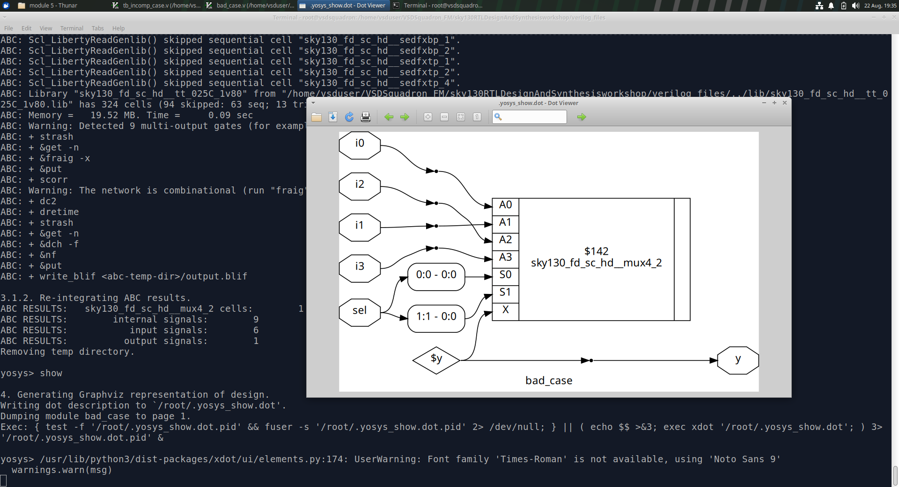

The synthesized diagram shows the hardware inferred from the incomplete case description.

## Bad Case - Waveform

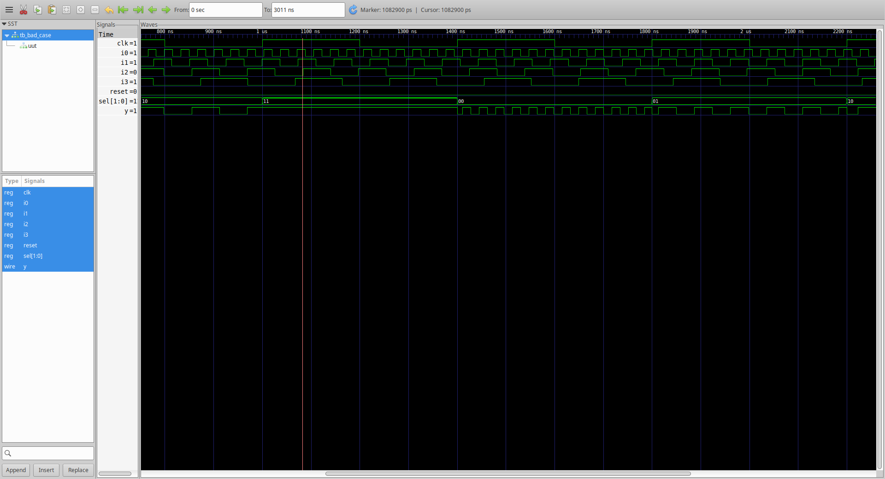

The waveform shows the simulation behavior of the bad case implementation.

---

# 4. DEMUX Using Case

A DEMUX distributes one input to one of several outputs depending on the select signal.

For an 8-output DEMUX:

```text
sel = 000 → o0
sel = 001 → o1
sel = 010 → o2
sel = 011 → o3
sel = 100 → o4
sel = 101 → o5
sel = 110 → o6
sel = 111 → o7
```

The DEMUX can be implemented using a `case` statement.

## RTL Code

```verilog
module demux_case (
    output o0,
    output o1,
    output o2,
    output o3,
    output o4,
    output o5,
    output o6,
    output o7,
    input [2:0] sel,
    input i
);

reg [7:0] y_int;

assign {o7,o6,o5,o4,o3,o2,o1,o0} = y_int;

always @(*)
begin

    y_int = 8'b0;

    case(sel)
        3'b000: y_int[0] = i;
        3'b001: y_int[1] = i;
        3'b010: y_int[2] = i;
        3'b011: y_int[3] = i;
        3'b100: y_int[4] = i;
        3'b101: y_int[5] = i;
        3'b110: y_int[6] = i;
        3'b111: y_int[7] = i;
    endcase

end

endmodule
```

The output vector is first initialized to zero.

The selected output is then assigned the input signal.

This produces the required DEMUX behavior.

## DEMUX Case - Synthesized Diagram

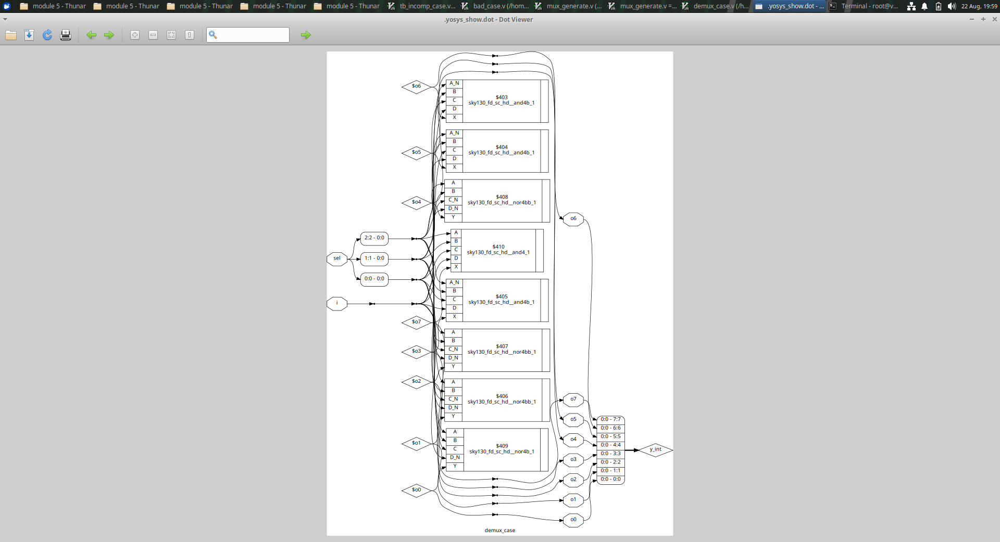

## DEMUX Case - Waveform

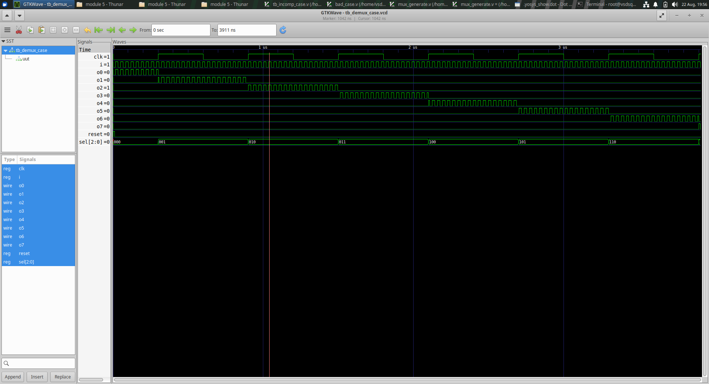

The waveform verifies that the input is routed to the selected output.

---

# 5. DEMUX Using Generate

A DEMUX can also be implemented using a `for` loop.

The loop checks every possible output position and activates the output corresponding to the select value.

## RTL Code

```verilog
module demux_generate (
    output o0,
    output o1,
    output o2,
    output o3,
    output o4,
    output o5,
    output o6,
    output o7,
    input [2:0] sel,
    input i
);

reg [7:0] y_int;

assign {o7,o6,o5,o4,o3,o2,o1,o0} = y_int;

integer k;

always @(*)
begin

    y_int = 8'b0;

    for(k = 0; k < 8; k = k + 1)
    begin
        if(k == sel)
            y_int[k] = i;
    end

end

endmodule
```

The `for` loop iterates through the eight possible output positions.

When the loop index matches the select value, the corresponding output is assigned the input.

## DEMUX Generate - Synthesized Diagram

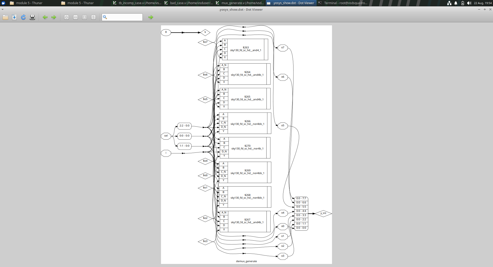

## DEMUX Generate - Waveform


The waveform verifies the behavior of the generate/for-loop based DEMUX.

---

# 6. MUX Using Generate

A MUX selects one input from several inputs based on a select signal.

The following example implements a 4:1 MUX using a `for` loop.

## RTL Code

```verilog
module mux_generate (
    input i0,
    input i1,
    input i2,
    input i3,
    input [1:0] sel,
    output reg y
);

wire [3:0] i_int;

assign i_int = {i3,i2,i1,i0};

integer k;

always @(*)
begin

    for(k = 0; k < 4; k = k + 1)
    begin
        if(k == sel)
            y = i_int[k];
    end

end

endmodule
```

The four inputs are combined into the internal vector `i_int`.

The loop checks the select value and assigns the corresponding input to `y`.

## MUX Generate - Synthesized Diagram

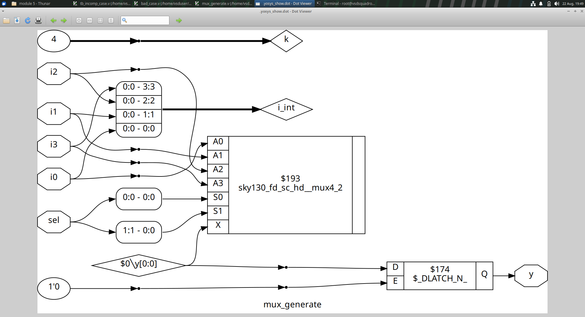

The synthesized diagram shows the MUX hardware inferred from the RTL.

## MUX Generate - Waveform

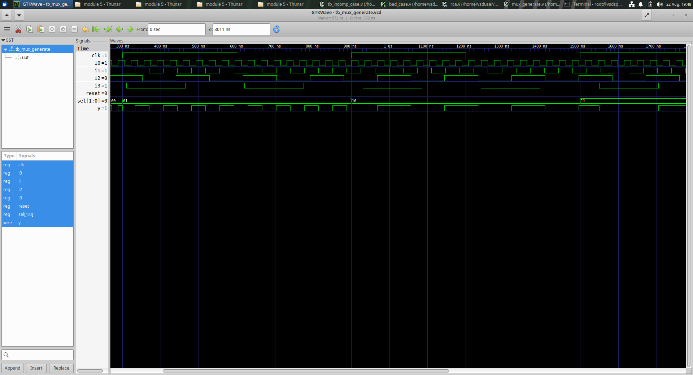

The waveform verifies the MUX selection behavior.

---

# 7. Incomplete Case

An incomplete case statement does not provide an assignment for every possible input condition.

## RTL Code

```verilog
module incomp_case (
    input i0,
    input i1,
    input i2,
    input [1:0] sel,
    output reg y
);

always @(*)
begin

    case(sel)
        2'b00: y = i0;
        2'b01: y = i1;
    endcase

end

endmodule
```

Only two select conditions are assigned.

When the other select values occur, there is no assignment to `y`.

Therefore, the synthesized design can infer a latch so that the previous output value is retained.

This is an important example of incomplete combinational coding.

## Incomplete Case - Synthesized Diagram

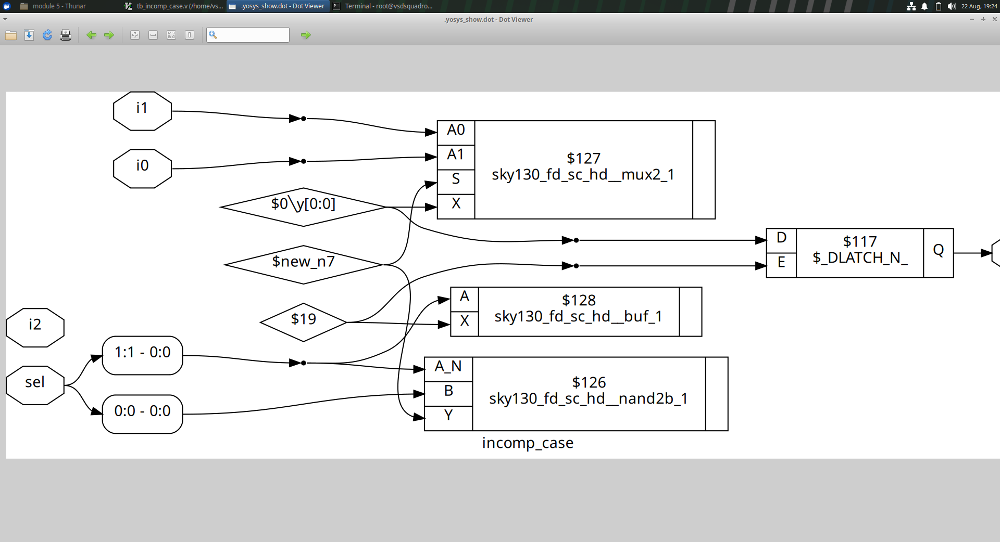

The diagram shows the latch inferred by synthesis due to the incomplete case statement.

## Incomplete Case - Waveform

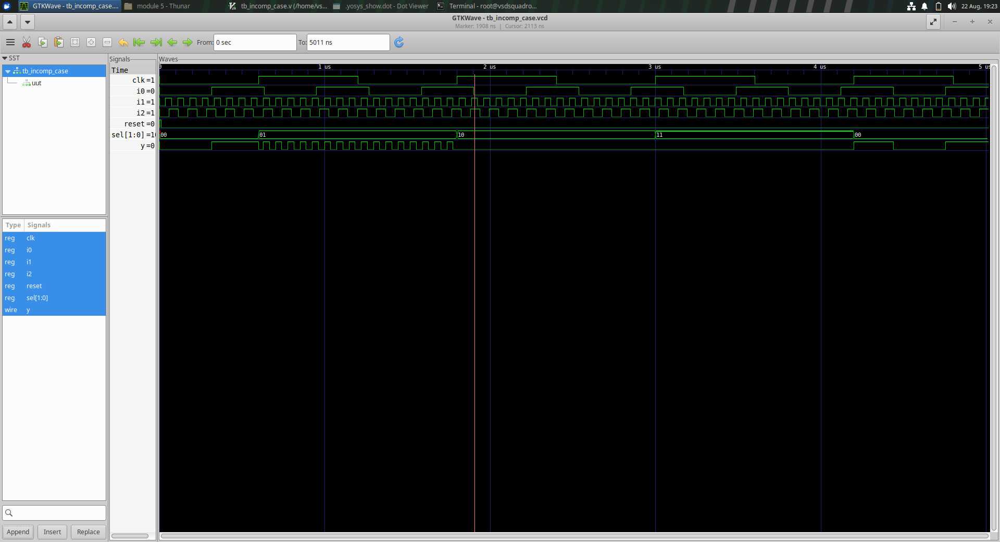

The waveform demonstrates the simulation behavior of the incomplete case.

---

# 8. Incomplete If

An incomplete `if` statement can also result in latch inference.

## RTL Code

```verilog
module incomp_if (
    input i0,
    input i1,
    input i2,
    output reg y
);

always @(*)
begin

    if(i0)
        y = i1;

end

endmodule
```

When `i0` is high, `y` receives the value of `i1`.

When `i0` is low, there is no assignment to `y`.

Therefore, the previous value may need to be retained.

This results in latch inference during synthesis.

## Incomplete If - Synthesized Diagram

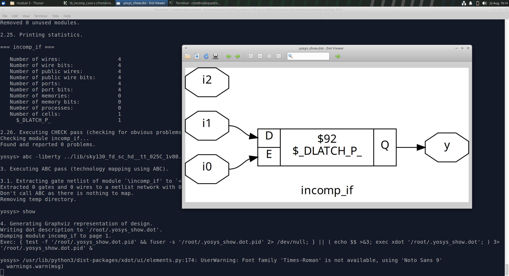

The synthesized diagram shows the inferred latch.

## Incomplete If - Waveform

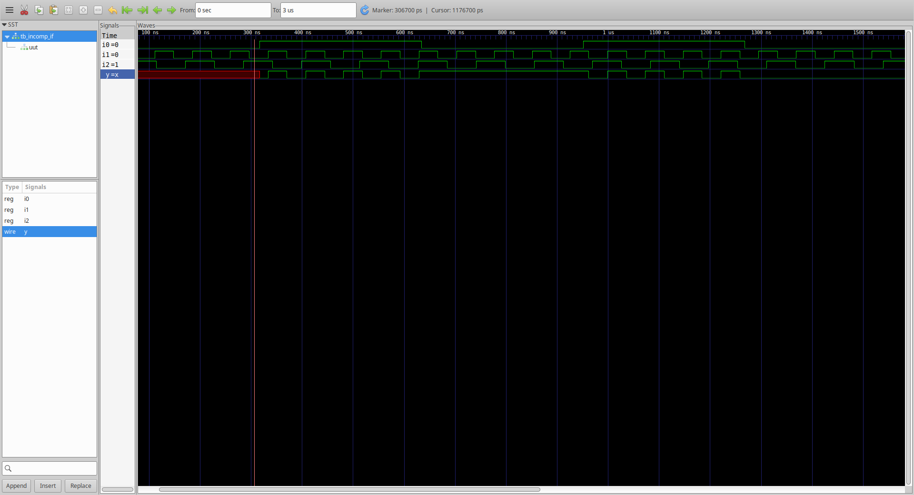

The waveform demonstrates the simulation behavior of the incomplete `if`.

---

# 9. Incomplete If2

A second incomplete `if` example uses an `if-else if` structure.

## RTL Code

```verilog
module incomp_if2 (
    input i0,
    input i1,
    input i2,
    input i3,
    output reg y
);

always @(*)
begin

    if(i0)
        y = i1;
    else if(i2)
        y = i3;

end

endmodule
```

Here, the output is assigned when either of the specified conditions is satisfied.

However, when neither condition is true, there is no assignment to `y`.

Therefore, synthesis can infer a latch.

This demonstrates why combinational logic should provide a complete output assignment for all possible input conditions.

## Incomplete If2 - Synthesized Diagram

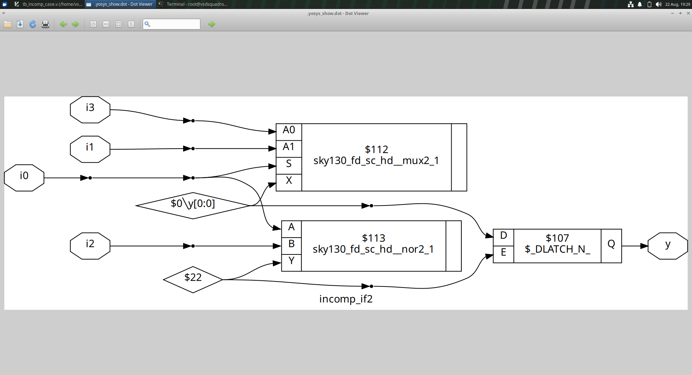

## Incomplete If2 - Waveform

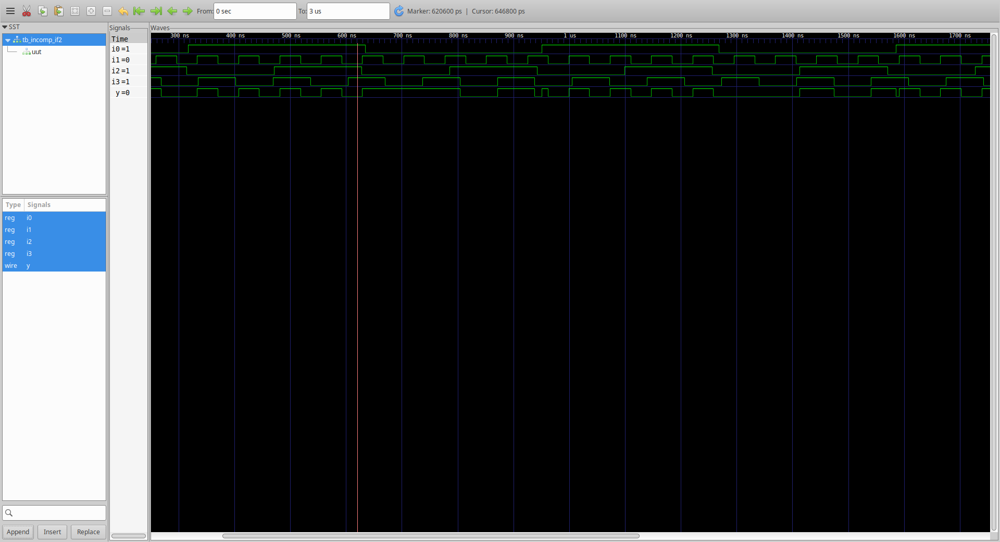

The waveform demonstrates the behavior of the incomplete `if-else if` implementation.

---

# 10. Testbenches

Testbenches are used to apply different input combinations to the RTL modules and observe the outputs.

VCD files are generated during simulation so that the waveforms can be analyzed using GTKWave.

## Testbench for Incomplete Case

```verilog
`timescale 1ns/1ps

module tb_incomp_case;

reg i0, i1, i2;
reg [1:0] sel;

wire y;

reg clk, reset;

incomp_case uut (
    .sel(sel),
    .i0(i0),
    .i1(i1),
    .i2(i2),
    .y(y)
);

initial begin

    $dumpfile("tb_incomp_case.vcd");
    $dumpvars(0,tb_incomp_case);

    i0 = 1'b0;
    i1 = 1'b0;
    i2 = 1'b0;
    sel = 2'b00;

    clk = 1'b0;
    reset = 1'b0;

    #10 reset = 1'b1;
    #10 reset = 1'b0;

    #500 $finish;

end

always #37 i0 = ~i0;
always #50 clk = ~clk;
always #47 i1 = ~i1;
always #57 i2 = ~i2;

endmodule
```

## Testbench for Incomplete If2

```verilog
`timescale 1ns/1ps

module tb_incomp_if2;

reg i0, i1, i2, i3;

wire y;

incomp_if2 uut (
    .i0(i0),
    .i1(i1),
    .i2(i2),
    .i3(i3),
    .y(y)
);

initial begin

    $dumpfile("tb_incomp_if2.vcd");
    $dumpvars(0,tb_incomp_if2);

    i0 = 1'b0;
    i1 = 1'b0;
    i2 = 1'b0;
    i3 = 1'b0;

    #300 $finish;

end

always #37 i0 = ~i0;
always #37 i1 = ~i1;
always #157 i2 = ~i2;
always #167 i3 = ~i3;

endmodule
```

## Testbench for Incomplete If

```verilog
`timescale 1ns/1ps

module tb_incomp_if;

reg i0, i1, i2;

wire y;

incomp_if uut (
    .i0(i0),
    .i1(i1),
    .i2(i2),
    .y(y)
);

initial begin

    $dumpfile("tb_incomp_if.vcd");
    $dumpvars(0,tb_incomp_if);

    i0 = 1'b0;
    i1 = 1'b0;
    i2 = 1'b0;

    #300 $finish;

end

always #37 i0 = ~i0;
always #37 i1 = ~i1;
always #57 i2 = ~i2;

endmodule
```

---

# 11. Ripple Carry Adder

A Ripple Carry Adder (RCA) is constructed using multiple Full Adders connected in series.

For an 8-bit RCA:

```text
FA0 → FA1 → FA2 → FA3 → FA4 → FA5 → FA6 → FA7
```

The carry output of each Full Adder becomes the carry input of the next Full Adder.

The RCA can be implemented using a generate loop.

## RCA RTL Code

```verilog
module rca (
    input [7:0] num1,
    input [7:0] num2,
    output [7:0] sum
);

wire [7:0] int_sum;
wire [7:0] int_co;

genvar i;

generate

    for(i = 1; i < 8; i = i + 1)
    begin

        fa u_fa (
            .a(num1[i]),
            .b(num2[i]),
            .cin(int_co[i-1]),
            .co(int_co[i]),
            .sum(int_sum[i])
        );

    end

endgenerate

fa u_fa0 (
    .a(num1[0]),
    .b(num2[0]),
    .cin(int_co[0]),
    .co(int_co[0]),
    .sum(int_sum[0])
);

assign sum[7:0] = int_sum[7:0];

endmodule
```

The generate loop creates multiple Full Adder instances.

The carry propagates from the least significant stage toward the most significant stage.

## RCA Waveform

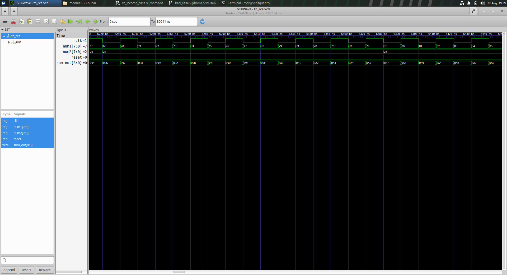

The waveform shows the input values and the resulting 8-bit sum.

---

# 12. Generate Construct

The `generate` construct is useful when the same hardware structure needs to be instantiated multiple times.

Example:

```verilog
genvar i;

generate

    for(i = 1; i < 8; i = i + 1)
    begin

        fa u_fa (
            .a(num1[i]),
            .b(num2[i]),
            .cin(int_co[i-1]),
            .co(int_co[i]),
            .sum(int_sum[i])
        );

    end

endgenerate
```

The generate loop creates repeated hardware during elaboration.

Generate constructs are useful for:

* Adders
* MUX structures
* DEMUX structures
* Repeated logic
* Arrays of hardware
* Parameterized designs

---

# 13. Verification

The experiments in this module were verified using RTL simulation, waveforms and synthesized circuit diagrams.

The verification flow was:

```text
RTL Code
   ↓
Simulation
   ↓
VCD Generation
   ↓
GTKWave
   ↓
Waveform Analysis
   ↓
Synthesis
   ↓
Synthesized Circuit
```

The experiments demonstrate that incomplete combinational descriptions can result in latch inference.

The complete DEMUX implementation correctly routes the input to the selected output.

The generate-based DEMUX and MUX demonstrate how repetitive hardware can be described using loops.

The Ripple Carry Adder demonstrates how multiple Full Adders can be connected using a generate construct.

---

# 14. Key Learning Outcomes

After completing this module, the following concepts were studied.

## Combinational Logic

* Combinational logic
* Case statements
* If statements
* Else-if statements
* Complete and incomplete assignments

## Case Statements

* Case-based logic
* Incomplete case
* Latch inference
* Synthesized hardware

## If Statements

* Incomplete if
* Incomplete if-else-if
* Latch inference
* Simulation behavior

## MUX

* 4:1 MUX
* MUX using a for loop
* Select-based logic
* Synthesized MUX

## DEMUX

* 1:8 DEMUX
* DEMUX using case
* DEMUX using for loop
* Select-based output routing

## Generate

* `genvar`
* `generate`
* Generate-for loop
* Repeated hardware instantiation

## Ripple Carry Adder

* Full Adder
* Carry propagation
* 8-bit RCA
* Generate-based RCA

## Verification

* RTL simulation
* Testbench development
* VCD generation
* GTKWave
* Waveform analysis
* Synthesis
* Synthesized circuit verification


# 15. Conclusion

This module demonstrates different techniques for describing combinational logic in Verilog.

The case statement example demonstrates how incomplete conditional assignments can lead to latch inference.

The DEMUX examples demonstrate both case-based and generate/for-loop based implementations.

The MUX example demonstrates the use of a loop to select one input from multiple inputs.

The incomplete case and incomplete if examples demonstrate the importance of complete assignments in combinational logic.

The Ripple Carry Adder demonstrates the use of generate constructs to instantiate multiple Full Adders and create a larger arithmetic circuit.

The synthesized diagrams and simulation waveforms provide verification of the implemented designs.

Overall, this module provides practical understanding of:

* Combinational Logic
* Case Statements
* If Statements
* Incomplete Combinational Logic
* Latch Inference
* MUX
* DEMUX
* Generate Constructs
* For Loops
* Ripple Carry Adder
* RTL Simulation
* VCD Waveforms
* GTKWave
* Synthesis
* Synthesized Circuit Analysis

---

# Module 5 Completed

## Topics Covered

* Combinational Logic Coding
* Case Statements
* Bad Case
* DEMUX Using Case
* DEMUX Using Generate
* MUX Using Generate
* Incomplete Case
* Incomplete If
* Incomplete If2
* Testbench Development
* VCD Generation
* Waveform Analysis
* Generate Constructs
* Ripple Carry Adder
* RTL Simulation
* Synthesis
* Synthesized Circuit Verification
